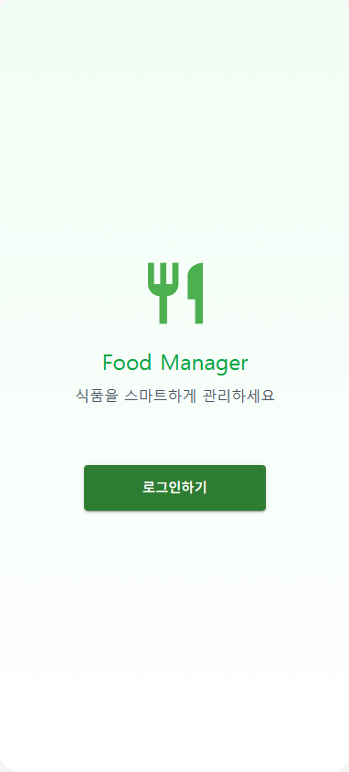
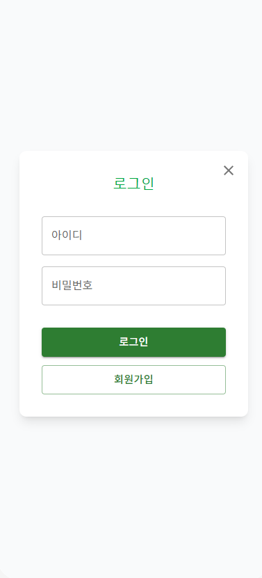
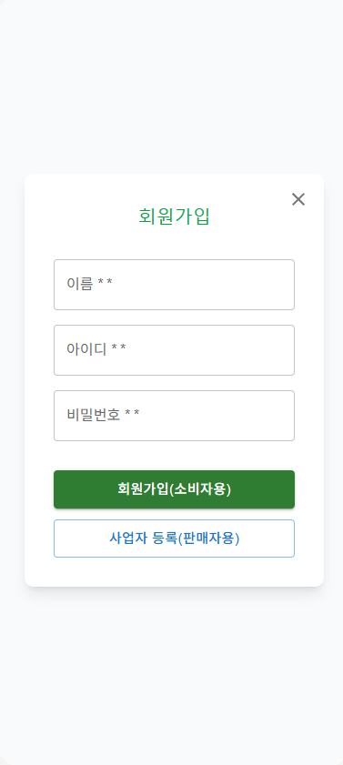
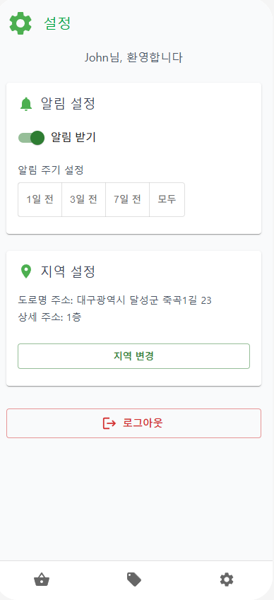

 
<h1> Food Manager</h1>
<h2 style="border-bottom: none;"> 

2. Anaylsis 

 
22211994,남재민,njm739@gmail.com</h2>

 
 
 
 
 
 
<h2 style="border-bottom: none;">
[ Revision history ]

| Revision date | Version # | Description | Author |
| :---: | :---: | :---: | :---: |
| 2026-05-05 | 1.0.0 | Initial Concept |Nam Jae-min |
</h2>

      
<h2 style="border-bottom: none;">
= Contents =
<pre>

1. Introduction ...........................................................
 
2. Use case analysis ......................................................
 
3. Domain analysis ........................................................
 
4. User Interface prototype ...............................................
 
5. Glossary ............................................................... 
 
6. References .............................................................
 

</pre>
</h2>

        

<h2>
1. Introduction
</h2>

1) Summary
 
사람들은 음식을 마트에서 장을 보고 보통 냉장고나 팬트리에 식료품을 저장한다. 하지만 바쁜 일상생활로 인해 냉장고(또는 보관소)에 어떤 음식이 있는지 소비기한은 언제까지인지 음식이 상하였는지 등등의 정보를 매번 확인할 수 없을 뿐만아니라 까먹는다. 그래서 현재 식료품에 존재하는 음식인데도 불구하고 있는지 까먹고 다시 또 산다거나, 소비기한이 지난지 모르고 먹어서 식중독에 걸리는 경우, 상한음식으로 인해서 식료품에서 냄새가 나는 불편함을 종종 겪는다. 그리고 마트나 편의점의 판매자의 경우도 소비기한이 얼마남지 않은 물품의 처리의 어려움과 할인을 했음에도 고객이 할인의 정보를 모르고 찾아오지않는 경우로 인해 마트나 편의점의 수익이 줄어드는 현상이 나타난다. 이러한 소비자와 판매자의 어려움을 해결하기위해서 Food Manager라는 시스템을 고안했다. 
  
2) Feature of "Food Manager"
 
소비자의 식료품의 현상황과 각 상품의 소비기한, 그리고 소비기한의 만료일에 따른 알림을 보내면서 식료품의 음식처리의 도움을 준다. 또 현재 식료품의 음식으로 만들 수 있는 레시피를 제공해서 '식료품 털기'를 할 수 있게한다. 생산자 입장에서는 어떤 제품이 많이 팔렸고 어떤 제품이 현재 재고가 많이 남았는지, 재고품의 소비기한은 언제인지 정보를 확인할 수 있다. 판매자는 현재 소비기한이 얼마 남지않은 재고품에 할인을 한다. 이때 할인을 생산자가 등록하면 Food Manager 서비스를 사용하는 마트 주변의 위치한 소비자에게 알림을 보내어서 광고효과도 누릴 수 있다. 
  
3) Goals
 
이번 보고서에는 Food Manager가 사용자(소비자와 판매자)에게 제공할 기능을 구체화해보고, 각 기능에 대한 세부사항을 명확하게 분석하고 필요한 선행조건,후행조건을 알아보고 각 기능의 시나리오,비기능적 요구사항들을 알아볼것이다. 또한 Food Manager의 User Interface prototype도 만들어볼 것이다. 
  

          

<h2>
2. Use case analysis
</h2>

2.1 Use case diagram

 
    
2.2 Use case description

| Use case #1 : Register | |
| :--- | :--- |
| **GENERAL CHARACTERISTICS** | |
| Summary | 사용자가 시스템의 기능을 사용하기 위해서 회원정보를 등록하는 기능 |
| Scope | Food Manager |
| Level | User Level |
| Author | Nam Jae Min |
| Last Update | 2026-05-05 |
| Status | Analysis |
| Primary Actor | User |
| Preconditions | 시스템이 정상적으로 실행되어야 한다. |
| Trigger | 로그인 화면에서 회원가입 버튼을 선택할 때 |
| Success Post Condition | 시스템에 사용자의 이름과 아이디와 비밀번호,사용자 유형을 데이터베이스에 등록하고 자동 로그인후 유형에 맞는 메인으로 이동한다. |
| Failed Post Condition | 시스템에 사용자의 이름과 아이디와 비밀번호,사용자 유형을 데이터베이스에 등록하지 못한다.|
| **MAIN SUCCESS SCENARIO** | |
| **Step** | **Action** |
| S | 사용자가 로그인 화면에서 회원가입을 선택한다. |
| 1 | 시스템은 회원가입을 위한 이름, 아이디, 비밀번호 입력화면을 출력한다. |
| 2 | 사용자가 필수정보(이름,아이디와 비밀번호) 입력한 후, 유형에 따라 [회원가입(소비자용)] 버튼 또는 [사업자 등록(판매자용)] 버튼을 클릭한다.    |
| 3 | 시스템은 입력받은 내용이 데이터베이스에 존재하는지 검사한다. |
| 4 | 시스템은 일치하는 정보가 없으면 계정정보를 데이터베이스에 저장한다. |
| 5 | 시스템은 사용자를 자동 로그인 처리하며, 판매자 유형일 경우 즉시 UC #13(Add Market) 화면으로 리다이렉트(Redirect)한다. |
| 6 | 정상적으로 정보가 등록되면 이 usecase는 끝난다.|
| **EXTENSION SCENARIO** | |
| **Step** | **Branching Action** | 
| 1 | 1a.  네트워크 오류나 통신장애로 인해 화면 출력이 되지않는 경우. |
||1a1. "통신이 원활하지 않습니다. 나중에 다시 시도하세요." 메시지를 출력한다.|
||1a2. 로그인화면으로 돌아간다.|
| 2 | 2a. 비밀번호를 7자리 미만으로 입력하는 경우.|
||2a1. "비밀번호는 7자리 이상이어야합니다." 메시지를 출력한다.|
||2b. 필수 정보(이름,아이디,비밀번호)이 누락된 경우.|
||2b1. "모든 필수 정보를 다 입력해주세요" 메시지를 출력한다.|
||2c. 사용자가 X(닫기) 버튼을 누르는 경우.|
||2c1. 진행중인 회원가입 프로세스를 중단하고, 로그인화면으로 이동한다. |
| 3 | 3a.  검사 시, 입력한 정보에서 아이디가 이미 존재하는경우 |
||3a1. "이미 존재하는 아이디입니다" 메시지를 출력한다.|
| 4 | 4a. 네트워크 오류나 통신장애로 인해 데이터베이스에 저장할 수 없는경우.|
||4a1.  "통신이 원활하지 않습니다. 나중에 다시 시도하세요." 메시지를 출력한다.|
| **RELATED INFORMATION** | |
| Performance | <= 3 second |
| Frequency | 사용자당 한번 |
| Concurrency | No Limits |
| Due Date | 2026.05.08 |

| Use case #2 : Login | |
| :--- | :--- |
| **GENERAL CHARACTERISTICS** | |
| Summary | 시스템이 사용자가 로그인시 입력한 정보를 일치하는지 확인하고 사용자 권한을 얻는 기능 |
| Scope | Food Mangager |
| Level | User Level |
| Author | Nam Jae Min |
| Last Update | 2026-05-05 |
| Status | Analysis |
| Primary Actor | User |
| Preconditions | 시스템의 데이터베이스에 사용자의 계정정보(아이디,비밀번호)를 등록되어 있어야  한다. |
| Trigger | 홈 화면에서 로그인 버튼을 선택할 때 |
| Success Post Condition | 사용자 인증 세션이 생성되고, 권한에 따른 메인 화면으로 진입한다. |
| Failed Post Condition | 사용자 인증 세션이 생성되지 않고, 권한에 따른 메인 화면으로 진입되지 못한다. |
| **MAIN SUCCESS SCENARIO** | |
| **Step** | **Action** |
| S | 사용자가 홈 화면에서 로그인 버튼을 선택한다. |
| 1 | 시스템은 아이디와 비밀번호를 입력하는 로그인 화면을 출력한다. |
| 2 | 사용자가 로그인 화면에서 아이디와 비밀번호를 입력하고 로그인버튼을 누른다. |
| 3 | 시스템은 입력한 정보가 데이터베이스에 등록되어있는지 확인한다. 등록되어있으면 로그인에 성공하고 사용자 유형(소비자/판매자)에 맞는 메인화면을 띄운다.  |
| 4 | 정상적으로 로그인에 성공하면 이 usecase는 끝난다. |
| **EXTENSION SCENARIO** | |
| **Step** | **Branching Action** |
| 1 | 1a. 네트워크 오류나 통신장애로 인해 화면 출력이 되지않는 경우. |
||1a1.  "통신이 원활하지 않습니다. 나중에 다시 시도하세요." 메시지를 출력한다.|
||1a2. 홈 화면으로 돌아간다. |
| 3 | 3a. 입력한 아이디나 비밀번호가 데이터베이스 내 정보와 일치하지않는 경우. |
||3a1. "아이디 또는 비밀번호가 다릅니다" 메시지를 출력한다. |
||3b. 아이디와 비밀번호가 누락된 경우.|
||3b1. "아이디와 비밀번호를 입력하세요" 메시지를 출력한다. |
||3c. 로그인화면에서 X(닫기) 버튼을 누르는 경우.|
||3c1. 로그인 프로세스를 중단하고 홈 화면으로 돌아간다. |
||3d. 네트워크 오류나 통신장애로 인해 데이터베이스와 통신이 원활하지않는 경우.|
||3d1.  "통신이 원활하지 않습니다. 나중에 다시 시도하세요." 메시지를 출력한다.|
||3e. [회원가입] 버튼을 누르는 경우.|
||3e1. 시스템은 로그인 프로세스를 종료하고, Use Case #1(Register)화면으로 이동한다.|
| **RELATED INFORMATION** | 
| Performance | <= 3 second |
| Frequency | Variable |
| Concurrency | No Limits |
| Due Date | 2026.05.08 |

| Use case #3 : Logout | |
| :--- | :--- |
| **GENERAL CHARACTERISTICS** | |
| Summary | 사용자가 시스템에서 계정을 로그아웃 하는 기능 |
| Scope | Food Mangager |
| Level | User Level |
| Author | Nam Jae Min |
| Last Update | 2026-05-06 |
| Status | Analysis |
| Primary Actor | User |
| Preconditions | 사용자가 로그인 된 상태여야 한다. |
| Trigger | 사용자가 설정화면에서 로그아웃을 선택할 때 |
| Success Post Condition | 사용자 세션이 파기되고, 홈 화면으로 이동한다. |
| Failed Post Condition | 로그아웃 처리가 되지않고 로그인 세션이 유지된다. |
| **MAIN SUCCESS SCENARIO** | |
| **Step** | **Action** |
| S | 사용자가 설정화면에서 로그아웃을 선택한다.|
| 1 | 시스템은 사용자의 로그아웃 의사를 재확인하기 위해 "로그아웃하시겠습니까?" 팝업 메시지를 출력한다. |
| 2 | 사용자가 확인을 누른다. |
| 3 | 시스템은 데이터베이스 내 기록된 사용자의 로그인 상태를 '로그아웃'으로 변경하고, 클라이언트의 인증 정보를 삭제한다. |
| 4 | 시스템은 로그아웃 완료메시지와 함께 사용자를 홈 화면으로 이동시킨다. |
| 5 | 정상적으로 처리되면 이 usecase는 끝난다.|
| **EXTENSION SCENARIO** | |
| **Step** | **Branching Action** |
| 1 | 1a. 사용자가 로그아웃 확인 팝업에서 취소를 선택하는 경우. |
||1a1. 로그아웃을 중단하고 현재 상태를 유지한다. |
| 3 | 3a. 서버와의 통신 문제로 로그아웃을 실패하는 경우. |
||3a1. "통신이 원활하지 않습니다. 나중에 다시 시도하세요." 메시지를 출력한다.|
| **RELATED INFORMATION** | |
| Performance | <= 3 second |
| Frequency | Variable |
| Concurrency | No Limits |
| Due Date | 2026.05.08 |

| Use case #4 :  | Register Region |
| :--- | :--- |
| **GENERAL CHARACTERISTICS** | |
| Summary | 사용자가 위치한 지역을 설정하는 기능 |
| Scope | Food Mangager |
| Level | User Level |
| Author | Nam Jae Min |
| Last Update | 2026-05-05 |
| Status | Analysis |
| Primary Actor | User |
| Preconditions | 사용자가 로그인이 되어있는 상태여야 한다. |
| Trigger | 설정 화면에서 [지역변경]을 선택하거나, 판매자가 사업장등록(usecase #13)을 진행하며 주소를 입력할 때 |
| Success Post Condition | 시스템의 데이터베이스에 사용자의 지역정보가 저장된다. |
| Failed Post Condition | 시스템의 데이터베이스에 사용자의 지역정보가 저장되지 않는다. |
| **MAIN SUCCESS SCENARIO** | |
| **Step** | **Action** |
| S | 사용자가 지역설정을 시작한다(설정 메뉴 혹은 사업자 등록 절차중). |
| 1 | 시스템은 사용자가 현재 자신의 지역을 입력할 수 있는 화면을 출력한다.  |
| 2 | 사용자가 도로명 주소를 검색하여 선택하고, 상세 주소(동, 호수 등)를 입력한 뒤 저장 버튼을 선택한다. |
| 3 | 시스템은 데이터베이스에 입력한 정보를 저장한다. |
| 4 | 정상적으로 저장되면 이 Usecase는 끝난다.|
| **EXTENSION SCENARIO** | |
| **Step** | **Branching Action** |
| 1 | 1a. 네트워크 오류나 통신장애로 인해 화면 출력이 되지않는 경우. |
||1a1.  "통신이 원활하지 않습니다. 나중에 다시 시도하세요." 메시지를 출력한다.|
||1a2. 설정화면으로 돌아간다. |
| 2 | 2a. 비정상적인 입력하는 경우. |
||2a1. "검색결과가 없습니다." 메시지를 출력한다. |
||2b. 취소버튼을 누르는 경우.|
||2b1. 지역설정 프로세스는 중단되고, 설정화면으로 돌아간다.|
||2c. 주소 검색 API 서비스에 장애가 발생한 경우.|
||2c1. "주소 서비스 점검 중입니다. 잠시 후 다시 시도해주세요" 메시지를 출력한다. | 
| 3 |3a. 네트워크 오류나 통신장애로 인해 데이터베이스와 통신이 원활하지않는 경우.|
||3a1.  "통신이 원활하지 않습니다. 나중에 다시 시도하세요." 메시지를 출력한다.|
| **RELATED INFORMATION** | |
| Performance | <= 3 second |
| Frequency | Variable |
| Concurrency | No Limits |
| Due Date | 2026.05.08 |

| Use case #5 :  | Set Notification |
| :--- | :--- |
| **GENERAL CHARACTERISTICS** | |
| Summary | 사용자가 알림 허용, 알림 주기 설정하는 기능 |
| Scope | Food Mangager |
| Level | User Level |
| Author | Nam Jae Min |
| Last Update | 2026-05-05 |
| Status | Analysis |
| Primary Actor | User |
| Preconditions | 사용자가 로그인이 되어있는 상태여야 한다. |
| Trigger | 설정화면에서 알림설정을 선택할 때 |
| Success Post Condition | 시스템에 사용자가 선택한 알림 활성화 여부 및 알림 주기가 저장된다. |
| Failed Post Condition | 시스템에 설정값이 저장되지 않고 이전 상태를 유지한다. |
| **MAIN SUCCESS SCENARIO** | |
| **Step** | **Action** |
| S | 사용자가 설정화면의 알림설정을 선택한다. |
| 1 | 시스템은 알림 활성화를 위한 토글 스위치를 출력한다.|
| 2 | 사용자가 알림 활성화 토글을 ON한다.|
| 3 | 시스템은 상세 주기 선택 버튼(1일 전, 3일 전, 7일 전, 모두) 버튼 그룹을 출력한다.|
| 4 | 사용자가 원하는 주기를 선택한다.|
| 5 | 시스템은 입력한 정보를 저장한다. 정상적으로 저장되면 이 Usecase는 끝난다.|
| **EXTENSION SCENARIO** | |
| **Step** | **Branching Action** |
| 1 | 1a. 네트워크 오류나 통신장애로 인해 화면 출력이 되지않는 경우. |
||1a1.  "통신이 원활하지 않습니다. 나중에 다시 시도하세요." 메시지를 출력한다.|
||1a2. 메인 화면으로 돌아간다.  |
| 2 | 2a. 알림 활성화 토글버튼을 ON에서 OFF하는 경우. 
||2a1. 알림 주기 설정에 대한 그룹 버튼을 숨김처리한다.|
||2a2. 시스템은 알림 비활성화 상태를 저장한다.|
|| 3 | 3a. 브라우저나 OS 차원에서 알림 권한이 거부되어 있는 경우. |
||3a1. 시스템은 토글을 ON을 바꿀때 "알림권한을 허용해 주세요" 라는 안내 팝업을 띄운다.|
| 5 | 5a. 네트워크 오류나 통신장애로 인해 저장에 실패하는 경우. |
||5a1. "통신이 원활하지 않습니다. 나중에 다시 시도하세요." 메시지를 출력한다.|
| **RELATED INFORMATION** | |
| Performance | <= 3 second |
| Frequency | Variable |
| Concurrency | No Limits |
| Due Date | 2026.05.08 |

| Use case #6 :  | Add Food |
| :--- | :--- |
| **GENERAL CHARACTERISTICS** | |
| Summary | 사용자가 시스템에 식품 정보를 등록하는 기능 |
| Scope | Food Mangager |
| Level | User Level |
| Author | Nam Jae Min |
| Last Update | 2026-05-05 |
| Status | Analysis |
| Primary Actor | User |
| Preconditions | 사용자가 로그인이 되어있는 상태여야한다. |
| Trigger | 메인 화면에서 항목 등록을 선택할때 |
| Success Post Condition | 시스템에 사용자가 식료품의 정보를 등록한다. |
| Failed Post Condition | 시스템에 식료품의 정보가 등록되지않는다. |
| **MAIN SUCCESS SCENARIO** | |
| **Step** | **Action** |
| S | 사용자가 메인 화면에 항목 등록을 선택한다. |
| 1 | 시스템은 식료품에 들어갈 식품의 카테고리,식품명,수량,식품의 소비기한(소비기한 없음도 포함)을 입력하는 화면을 출력한다.|
| 2 | 사용자가 해당하는 식품의 식품명 수량을 입력하고 카테고리를 선택한다.|
| 3 | 시스템은 선택된 카테고리의 권장 소비기한을 계산하여 입력란에 자동 반영한다.|
| 4 | 사용자는 소비기한을 확인하거나 직접 수정할 수 있으며, 모든 항목을 다 입력한 후,등록버튼을 누른다.|
| 5 | 시스템은 입력된 정보를 데이터베이스에 저장하고 메인 화면으로 이동한다. 정상적으로 저장되면 이 Usecase는 끝난다.|
| **EXTENSION SCENARIO** | |
| **Step** | **Branching Action** |
| 1 |1a. 네트워크 오류나 통신장애로 인해 화면 출력이 되지않는 경우. |
||1a1. "통신이 원활하지 않습니다. 나중에 다시 시도하세요." 메시지를 출력한다.|
||1a2. 메인 화면으로 돌아간다. |
| 2 |2a. 입력중 취소버튼을 누르는 경우. |
||2a1. 메인 화면으로 돌아간다.|
| 3 |3a. 소비기한 없음을 누른 경우.|
||3a1. 시스템은 소비기한 입력란을 비활성화하고 소비기한을 소비기한 없음으로 저장한다.|
| 4 |4a. 항목이 누락되어 있는 경우.|
||4a1. "모든 항목을 입력해주세요." 메시지를 출력한다.|
||4b. 수량정보에서 0이하의 값이 입력된 경우. |
||4b1. 시스템은 사용자의 등록 요청을 무시한다. | 
||4b2. 시스템은 "수량은 1개 이상이어야 합니다." 메시지를 출력한다.|
||4c. 소비기한이 현재 날짜 이전인 경우.|
||4c1. 시스템은 사용자의 등록 요청을 무시한다.|
||4c2. 시스템은 "소비기한은 오늘 이후여야 합니다." 메시지를 출력한다.|
| 5 |5a. 네트워크 오류나 통신장애로 인해 저장에 실패하는 경우. |
||5a1. "통신이 원활하지 않습니다. 나중에 다시 시도하세요." 메시지를 출력한다.|
| **RELATED INFORMATION** | |
| Performance | <= 3 second |
| Frequency | Variable |
| Concurrency | No Limits |
| Due Date | 2026.05.08 |

| Use case #7 :  | Check Expiry Date |
| :--- | :--- |
| **GENERAL CHARACTERISTICS** | |
| Summary | 사용자가 시스템에 등록된 식품 정보를 확인하는 기능 |
| Scope | Food Mangager |
| Level | User Level |
| Author | Nam Jae Min |
| Last Update | 2026-05-05 |
| Status | Analysis |
| Primary Actor | User |
| Preconditions | 사용자가 로그인이 되어있는 상태여야한다. |
| Trigger | 메인 화면에서 소비기한 조회를 선택할때 |
| Success Post Condition | 사용자가 식료품에 등록된 품목의 소비기한을 확인한다. |
| Failed Post Condition | 사용자가 식료품에 등록된 품목의 소비기한을 확인하지 못한다. |
| **MAIN SUCCESS SCENARIO** | |
| **Step** | **Action** |
| S |사용자가 메인 화면에서 소비기한 조회를 선택할 때 시작된다.|
| 1 |시스템은 데이터베이스에서 해당 사용자의 식료품 식품 리스트를 가져온다.|
| 2 |시스템은 현재 날짜를 기준으로 각 식품의 남은 소비기한(D-Day)을 계산한다.|
| 3 |시스템은 소비기한이 가장 적게 남은 순서대로 정렬하여 리스트 화면을 출력한다.(소비기한이 없으면 제일 아래에 출력,소비기한이 동일한 경우 이름순으로 출력한다.)|
| 4 |시스템은 소비기한이 지난 품목은 별도의 강조 색상(만료시:빨간색,3일이내:주황색,3일이후:초록색,소비기한 없음:흰색)으로 표시한다.|
| 5 |정상적으로 화면이 출력되면 이 usecase는 끝난다.|
| **EXTENSION SCENARIO** | |
| **Step** | **Branching Action** |
| 1 | 1a. 식료품에 등록된 식료품 데이터가 없는 경우|
||1a1. "등록된 식료품이 없습니다." 메시지를 출력한다.|
||1b. 네트워크 오류나 통신장애로 인해 데이터베이스와의 통신이 원활하지 않는 경우. |
||1b1. "통신이 원활하지 않습니다. 나중에 다시 시도하세요." 메시지를 출력한다.|
||1b2. 메인 화면으로 돌아간다. |
| 2 | 2a. 네트워크 오류나 통신장애로 인해 계산이 원활하지 않는 경우. |
||2a1. "통신이 원활하지 않습니다. 나중에 다시 시도하세요." 메시지를 출력한다.|
||2a2. 메인 화면으로 돌아간다. |
| 3 | 3a. 네트워크 오류나 통신장애로 인해 화면 출력이 되지않는 경우. |
||3a1. "통신이 원활하지 않습니다. 나중에 다시 시도하세요." 메시지를 출력한다.|
||3a2. 메인 화면으로 돌아간다. |
| **RELATED INFORMATION** | |
| Performance | <= 3 second |
| Frequency | Variable |
| Concurrency | No Limits |
| Due Date | 2026.05.08 |

| Use case #8 :  | Delete Food |
| :--- | :--- |
| **GENERAL CHARACTERISTICS** | |
| Summary | 사용자가 현재 시스템에 등록된 품목정보를 삭제하는 기능. |
| Scope | Food Mangager |
| Level | User Level |
| Author | Nam Jae Min |
| Last Update | 2026-05-05 |
| Status | Analysis |
| Primary Actor | User |
| Preconditions | 사용자가 로그인이 되어있어야한다. |
| Trigger | 메인 화면에서 식료품 삭제를 선택할 때 |
| Success Post Condition | 사용자는 식료품에 있는 품목정보를 삭제한다. |
| Failed Post Condition | 사용자는 식료품에 있는 품목정보를 삭제하지못한다. |
| **MAIN SUCCESS SCENARIO** | |
| **Step** | **Action** |
| S | 사용자가 메인 화면에서 식료품 삭제를 선택한다.|
| 1 | 시스템은 현재 접속한 사용자가 등록한 식료품 리스트를 데이터베이스에서 가져온다.|
| 2 | 시스템은 소비기한 만료순으로 식료품 리스트를 출력한다.|
| 3 | 사용자가 삭제를 원하는 품목을 선택하고 삭제[휴지통] 버튼을 누른다.|
| 4 | 시스템은 "정말로 삭제하시겠습니까?" 확인 메시지를 출력한다.|
| 5 | 사용자가 확인 버튼을 선택한다.|
| 6 | 시스템은 해당 식품정보를 데이터베이스에서 삭제하고 갱신된 리스트를 출력한다.|
| 7 | 정상적으로 삭제되면 이 usecase는 끝난다.|
| **EXTENSION SCENARIO** | |
| **Step** | **Branching Action** |
| 1 | 1a. 등록한 식료품 정보가 없는 경우.|
||1a1. "등록된 식료품이 없습니다"라는 메세지를 출력한다.|
||1b. 네트워크 오류나 통신장애로 인해 데이터베이스와의 통신이 원활하지 않는 경우. |
||1b1. "통신이 원활하지 않습니다. 나중에 다시 시도하세요." 메시지를 출력한다.|
||1b2. 메인 화면으로 돌아간다. |
| 2 | 2a. 네트워크 오류나 통신장애로 인해 화면 출력이 되지않는 경우. |
||2a1. "통신이 원활하지 않습니다. 나중에 다시 시도하세요." 메시지를 출력한다.|
||2a2. 메인 화면으로 돌아간다. |
| 3 | 3a. 취소버튼을 누르는 경우.|
||3a1. 메인 화면으로 이동한다. |
| 4 | 4a. 사용자가 확인 팝업에서 취소를 선택하는 경우.|
||4a1. 삭제 요청을 무시하고 식료품 삭제 화면을 유지한다.|
||4b. 네트워크 오류나 통신장애로 인해 화면 출력이 되지않는 경우. |
||4b1. "통신이 원활하지 않습니다. 나중에 다시 시도하세요." 메시지를 출력한다.|
| 6 | 6a. 데이터베이스 처리 중 오류가 발생한 경우.|
||6a1. "삭제에 실패하였습니다. 다시 시도해주세요" 메시지를 출력한다.|
||6b. 네트워크 오류나 통신장애로 인해 화면 출력이 되지않는 경우. |
||6b1. "통신이 원활하지 않습니다. 나중에 다시 시도하세요." 메시지를 출력한다.|
||6b2. 메인 화면으로 돌아간다. |
| **RELATED INFORMATION** | |
| Performance | <= 3 second |
| Frequency | Variable |
| Concurrency | No Limits |
| Due Date | 2026.05.08 |

| Use case #9 :  | Update Food |
| :--- | :--- |
| **GENERAL CHARACTERISTICS** | |
| Summary | 사용자가 현재 시스템에 등록된 품목정보를 변경하는 기능. |
| Scope | Food Mangager |
| Level | User Level |
| Author | Nam Jae Min |
| Last Update | 2026-05-05 |
| Status | Analysis |
| Primary Actor | User |
| Preconditions | 사용자가 로그인이 되어있어야한다. |
| Trigger | 메인 화면에서 식료품 수정을 선택할 때 |
| Success Post Condition | 사용자는 식료품에 있는 품목정보를 변경한다 |
| Failed Post Condition | 사용자는 식료품에 있는 품목정보를 변경하지못한다. |
| **MAIN SUCCESS SCENARIO** | |
| **Step** | **Action** |
| S | 사용자가 메인 화면에서 식료품 수정을 선택할때 |
| 1 | 시스템은 현재 접속한 사용자가 등록한 식료품 리스트를 데이터베이스에서 가져온다.|
| 2 | 시스템은 소비기한 만료순으로 식료품 리스트를 출력한다.|
| 3 | 사용자가 변경을 원하는 항목을 선택하고 변경 버튼을 누른다.|
| 4 | 시스템은 변경하려는 항목의 기존정보을 기본값(Default)으로 가지는 UC#6(Add Food)의 입력화면과 같은 화면을 출력한다.|
| 5 | 사용자가 변경된 정보를 입력한다.|
| 6 | 시스템은 해당 식품정보를 데이테베이스에서 변경하고 "식료품 정보가 수정되었습니다." 메시지를 출력한다.|
| 7 | 시스템은 갱신된 리스트를 출력한다.|
| 8 | 정상적으로 변경되면 이 usecase는 끝난다.|
| **EXTENSION SCENARIO** | |
| **Step** | **Branching Action** |
| 1 | 1a. 등록한 식료품 정보가 없는 경우.|
||1a1. "등록된 식료품이 없습니다"라는 메세지를 출력한다.|
||1b. 네트워크 오류나 통신장애로 인해 데이터베이스와의 통신이 원활하지 않는 경우. |
||1b1. "통신이 원활하지 않습니다. 나중에 다시 시도하세요." 메시지를 출력한다.|
||1b2. 메인 화면으로 돌아간다. |
| 2 | 2a. 네트워크 오류나 통신장애로 인해 화면 출력이 되지않는 경우. |
||2a1. "통신이 원활하지 않습니다. 나중에 다시 시도하세요." 메시지를 출력한다.|
||2a2. 메인 화면으로 돌아간다. |
| 3 | 3a. 취소버튼을 누르는 경우.|
||3a1. 메인 화면으로 이동한다. |
| 4 | 4a. 네트워크 오류나 통신장애로 인해 화면 출력이 되지않는 경우. |
||4a1. "통신이 원활하지 않습니다. 나중에 다시 시도하세요." 메시지를 출력한다.|
||4a2. 메인 화면으로 돌아간다. |
| 5 |5a. 항목이 누락되어 있는 경우.|
||5a1. "모든 항목을 입력해주세요." 메시지를 출력한다.|
||5b. 소비기한이 현재 날짜 이전인 경우.|
||5b1. 시스템은 사용자의 등록 요청을 무시한다.|
||5b2. 시스템은 "소비기한은 오늘 이후여야 합니다." 메시지를 출력한다.|
||5c. 수량정보에서 0이하의 값이 입력된 경우. |
||5c1. 시스템은 사용자의 등록 요청을 무시한다. | 
||5c2. 시스템은 "수량은 1개 이상이어야 합니다." 메시지를 출력한다.|
| 6 |6a. 네트워크 오류나 통신장애로 인해 데이터베이스와의 통신이 원활하지 않는 경우. |
||6a1. "통신이 원활하지 않습니다. 나중에 다시 시도하세요." 메시지를 출력한다.|
||6a2. 메인 화면으로 돌아간다. |
||6b. 네트워크 오류나 통신장애로 인해 화면 출력이 되지않는 경우. |
||6b1. "통신이 원활하지 않습니다. 나중에 다시 시도하세요." 메시지를 출력한다.|
||6b2. 메인 화면으로 돌아간다. |
| 7 | 7a. 네트워크 오류나 통신장애로 인해 화면 출력이 되지않는 경우. |
||7a1. "통신이 원활하지 않습니다. 나중에 다시 시도하세요." 메시지를 출력한다.|
||7a2. 메인 화면으로 돌아간다. |
| **RELATED INFORMATION** | |
| Performance | <= 3 second |
| Frequency | Variable |
| Concurrency | No Limits |
| Due Date | 2026.05.08 |

| Use case #10 :  | Search Food |
| :--- | :--- |
| **GENERAL CHARACTERISTICS** | |
| Summary | 사용자가 현재 시스템에 등록된 품목을 검색 조건에 맞게 검색하는 기능. |
| Scope | Food Mangager |
| Level | User Level |
| Author | Nam Jae Min |
| Last Update | 2026-05-06 |
| Status | Analysis |
| Primary Actor | User |
| Preconditions | 사용자가 로그인이 되어있어야함. |
| Trigger | 메인 화면에서 식료품 검색을 선택할때 |
| Success Post Condition | 사용자는 식료품에 있는 품목을 검색한다. |
| Failed Post Condition | 사용자는 식료품에 있는 품목을 검색하지못한다. |
| **MAIN SUCCESS SCENARIO** | |
| **Step** | **Action** |
| S | 사용자가 메인 화면에서 식료품 검색을 선택할때 |
| 1 | 시스템은 검색할 조건(카테고리,항목명,식품기한)에 맞게 입력할 화면을 출력한다.|
| 2 | 사용자는 검색할 조건으로 검색조건을 선택하고 각 항목을 입력하고 검색한다.|
| 3 | 시스템은 데이터베이스에서 입력된 조건에 맞는 식료품 리스트를 가져온다.|
| 4 | 시스템은 검색한 식료품 리스트를 출력한다.|
| 5 | 정상적으로 출력되면 이 usecase는 끝난다.|
| **EXTENSION SCENARIO** | |
| **Step** | **Branching Action** |
| 1 | 1a. 네트워크 오류나 통신장애로 인해 화면 출력이 되지않는 경우. |
||1a1. "통신이 원활하지 않습니다. 나중에 다시 시도하세요." 메시지를 출력한다.|
||1a2. 메인 화면으로 돌아간다. |
| 2 | 2a. 취소버튼을 누르는 경우. |
||2a1. 메인 화면으로 돌아간다. |
| 3 | 3a. 네트워크 오류나 통신장애로 인해 데이터베이스와의 통신이 원활하지 않는 경우. |
||3a1. "통신이 원활하지 않습니다. 나중에 다시 시도하세요." 메시지를 출력한다.|
| 4 | 4a. 조건에 해당하는 식료품이 존재하지 않는 경우. |
||4a1. "검색 결과가 없습니다." 메시지를 출력한다.|
||4b. 네트워크 오류나 통신장애로 인해 화면 출력이 되지않는 경우. |
||4b1. "통신이 원활하지 않습니다. 나중에 다시 시도하세요." 메시지를 출력한다.|
||4b2. 메인 화면으로 돌아간다. |
| **RELATED INFORMATION** | |
| Performance | <= 3 second |
| Frequency | Variable |
| Concurrency | No Limits |
| Due Date | 2026.05.08 |

| Use case #11 :  | Check Sale |
| :--- | :--- |
| **GENERAL CHARACTERISTICS** | |
| Summary | 소비자가 주변에 있는 가게의 할인정보를 확인하는 기능 |
| Scope | Food Mangager |
| Level | User Level |
| Author | Nam Jae Min |
| Last Update | 2026-05-05 |
| Status | Analysis |
| Primary Actor | Consumer |
| Preconditions | 소비자가 로그인이 되어있고 지역정보가 등록되어 있어야함. |
| Trigger | 할인 메뉴를 선택할때 |
| Success Post Condition | 소비자가 주변 가게의 리스트를 확인하며, 등록된 할인을 확인한다. |
| Failed Post Condition | 소비자가 주변 가게의 리스트를 확인하지 못하며, 등록된 할인을 확인하지못한다. |
| **MAIN SUCCESS SCENARIO** | |
| **Step** | **Action** |
| S | 소비자가 할인메뉴에서 할인중인 가게확인을 선택한다.|
| 1 | 시스템은 현재 소비자가 등록한 지역에 주변에서 할인하고 있는 가게 목록을 데이터베이스로 부터 가져온다.|
| 2 | 시스템은 가게목록의 정보를 거리순으로 가게 리스트를 출력한다.|
| 3 | 소비자가 원하는 가게를 선택한다.|
| 4 | 시스템은 그 가게에 대한 자세한 할인정보를 출력한다.|
| 5 | 정상적으로 출력되면 이 Usecase는 끝난다.|
| **EXTENSION SCENARIO** | |
| **Step** | **Branching Action** |
| 1 | 1a. 주변에 있는 가게의 할인정보가 없는 경우.|
||1a1. "주변에 할인중인 가게가 없습니다"라는 메세지를 출력한다.|
||1b. 지역정보가 등록되어있지 않은 경우.|
||1b1. "지역 설정이 필요합니다. 주변 할인 정보를 확인하려면 먼저 지역 설정을 해주세요. 설정 페이지로 이동하시겠습니까?" 메시지를 출력한다.|
||1b2. 소비자가 [설정하러 가기] 버튼을 누르면 설정화면으로 이동하고 UC#4(Register Region)을 수행한다.|
||1b3. 소비자가 [나중에] 버튼을 선택하면 메인 화면으로 이동한다.|
||1c. 네트워크 오류나 통신장애로 인해 데이터베이스와의 통신이 원활하지 않는 경우. |
||1c1. "통신이 원활하지 않습니다. 나중에 다시 시도하세요." 메시지를 출력한다.|
||1c2. 메인 화면으로 돌아간다.|
| 2 |2a. 네트워크 오류나 통신장애로 인해 화면 출력이 되지않는 경우. |
||2a1. "통신이 원활하지 않습니다. 나중에 다시 시도하세요." 메시지를 출력한다.|
||2a2. 메인 화면으로 돌아간다. |
| 4 |4a. 네트워크 오류나 통신장애로 인해 화면 출력이 되지않는 경우. |
||4a1. "통신이 원활하지 않습니다. 나중에 다시 시도하세요." 메시지를 출력한다.|
||4a2. 가게 리스트 출력화면으로 돌아간다. |
| **RELATED INFORMATION** | |
| Performance | <= 3 second |
| Frequency | Variable |
| Concurrency | No Limits |
| Due Date | 2026.05.08 |

| Use case #12 :  | Check recipe |
| :--- | :--- |
| **GENERAL CHARACTERISTICS** | |
| Summary | 소비자가 현재 식료품으로 만들 수 있는 레시피를 확인하는 기능. |
| Scope | Food Mangager |
| Level | User Level |
| Author | Nam Jae Min |
| Last Update | 2026-05-06 |
| Status | Analysis |
| Primary Actor | Consumer |
| Preconditions | 소비자가 로그인이 되어있어야함. |
| Trigger | 메인 화면에서 레시피 메뉴를 선택할 때 |
| Success Post Condition | 소비자는 등록된 식료품으로 만들 수 있는 레시피를 확인한다. |
| Failed Post Condition | 소비자는 등록된 식료품으로 만들 수 있는 레시피를 확인하지못한다.|
| **MAIN SUCCESS SCENARIO** | |
| **Step** | **Action** |
| S | 소비자가 메인 화면에서 레시피 메뉴를 선택할때 발생한다.|
| 1 | 시스템은 현재 접속한 소비자가 등록한 식료품 리스트를 데이터베이스에서 가져온다.|
| 2 | 시스템은 현재 식료품 리스트로 데이터베이스에 있는 레시피에서 재료 및 수량이 모두 해당하는지 계산한다.|
| 3 | 시스템은 현재 식료품으로 바로 만들 수 있는 레시피(초록색으로 표시)와 몇몇개의 재료만 부족한 레시피(주황색으로 표시)도 출력한다. 그리고 부족한 재료의 리스트를 출력한다.|
| 4 | 소비자가 해당 레시피를 누르면 레시피의 자세한 내용을 출력한다.|
| 5 | 정상적으로 출력되면 이 usecase는 끝난다.|
| **EXTENSION SCENARIO** | |
| **Step** | **Branching Action** |
| 1 |1a. 네트워크 오류나 통신장애로 인해 데이터베이스와의 통신이 원활하지 않는 경우. |
||1a1. "통신이 원활하지 않습니다. 나중에 다시 시도하세요." 메시지를 출력한다.|
||1a2. 메인 화면으로 돌아간다.|
| 2 |2a. 네트워크 오류나 통신장애로 인해 계산이 원활하지 않는 경우. |
||2a1. "통신이 원활하지 않습니다. 나중에 다시 시도하세요." 메시지를 출력한다.|
||2a2. 메인 화면으로 돌아간다.|
| 3 | 3a. 네트워크 오류나 통신장애로 인해 화면 출력이 되지않는 경우. |
||3a1. "통신이 원활하지 않습니다. 나중에 다시 시도하세요." 메시지를 출력한다.|
||3a2. 메인 화면으로 돌아간다. |
| 4 | 4a. 네트워크 오류나 통신장애로 인해 화면 출력이 되지않는 경우. |
||4a1. "통신이 원활하지 않습니다. 나중에 다시 시도하세요." 메시지를 출력한다.|
||4a2. 레시피 화면으로 돌아간다. |
| **RELATED INFORMATION** | |
| Performance | <= 3 second |
| Frequency | Variable |
| Concurrency | No Limits |
| Due Date | 2026.05.08 |

| Use case #13 :  | Add Market |
| :--- | :--- |
| **GENERAL CHARACTERISTICS** | |
| Summary | 판매자는 자신의 사업장을 등록하는 기능. |
| Scope | Food Mangager |
| Level | User Level |
| Author | Nam Jae Min |
| Last Update | 2026-05-06 |
| Status | Analysis |
| Primary Actor | Seller |
| Preconditions | 판매자는 로그인되어 있어야한다. |
| Trigger | 판매자가 회원가입 화면에서 정보를 입력한 후 사업장 등록(판매자용) 선택할때 |
| Success Post Condition | 판매자는 시스템에 자신의 사업장 정보를 등록한다. |
| Failed Post Condition | 판매자는 시스템에 자신의 사업장 정보를 등록하지못한다. |
| **MAIN SUCCESS SCENARIO** | |
| **Step** | **Action** |
| S | 판매자가 회원가입 화면에서 사업장 등록(판매자용)을 선택한다. |
| 1 | 시스템은 사업장 이름, 사업자 이름, 사업장 번호, 카테고리(마트, 편의점 등)와 주소 UC#4(Register Region)를 입력할 수 있는 화면을 출력한다.|
| 2 | 판매자가 자신의 사업장 상세 정보를 입력하고 등록버튼을 누른다.|
| 3 | 시스템은 사업자 등록번호 형식 및 중복 여부 등을 검사하고 데이터베이스에 판매자 계정과 연결하여 저장한다.|
| 4 | 시스템은 정보가 정상적일경우, 등록완료 메시지를 출력하고, 메인 관리 화면으로 이동한다.|
| 5 | 정상적으로 등록되면 이 usecase는 끝난다.|
| **EXTENSION SCENARIO** | |
| **Step** | **Branching Action** |
| 2 |2a. 필수 입력 항목이 누락된 경우. |
||2a1. "모든 항목을 입력해주세요." 메시지를 출력한다.|
||2b. X(닫기) 버튼을 누르는 경우.|
||2b1. 사업자 등록 프로세스가 중단되며, 회원가입 화면으로 돌아간다.|
| 3 |3a. 네트워크 오류나 통신장애로 인해 데이터베이스와의 통신이 원활하지 않는 경우. |
||3a1. "통신이 원활하지 않습니다. 나중에 다시 시도하세요." 메시지를 출력한다.|
| 4 | 4a. 이미 동일한 사업장 번호나 이름으로 등록된 사업장이 있는 경우. |
||4a1. "이미 등록된 사업장 정보입니다" 메시지를 출력한다. |
||4b. 유효하지않는 사업장 번호나 이름인경우. |
||4b1. "유효하지않는 사업장 번호 또는 이름입니다."메시지를 출력한다.|
||4c. 네트워크 오류나 통신장애로 인해 저장이 되지않는 경우. |
||4c1. "통신이 원활하지 않습니다. 나중에 다시 시도하세요." 메시지를 출력한다.|
| **RELATED INFORMATION** | |
| Performance | <= 3 second |
| Frequency | Seller당 한번 |
| Concurrency | No Limits |
| Due Date | 2026.05.08 |

| Use case #14 :  | Add Sale Information |
| :--- | :--- |
| **GENERAL CHARACTERISTICS** | |
| Summary | 판매자는 자신의 사업장에 있는 품목에 대한 할인정보를 추가하는 기능. |
| Scope | Food Mangager |
| Level | User Level |
| Author | Nam Jae Min |
| Last Update | 2026-05-06 |
| Status | Analysis |
| Primary Actor | Seller |
| Preconditions | 판매자는 로그인되어 있어야하고 사업장이 등록되어 있어야한다. |
| Trigger | 판매자가 할인 정보 관리 화면에서 할인정보를 등록할 때 |
| Success Post Condition | 할인정보가 시스템에 등록되어 소비자들에게 노출됨. |
| Failed Post Condition | 할인정보가 등록되지않음. |
| **MAIN SUCCESS SCENARIO** | |
| **Step** | **Action** |
| S | 판매자가 할인 정보 관리 화면에서 할인정보 등록을 선택한다. |
| 1 | 시스템은 사업장에 등록된 식료품 리스트를 데이터베이스로부터 가져온다.|
| 2 | 시스템은 할인할 내용을 입력할 화면(할인 품목 선택창,할인 가격,할인 기간)을 출력한다.|
| 3 | 판매자가 할인품목명,할인가격,행사 기간을 입력한다.|
| 4 | 시스템은 해당하는 품목의 재고수량을 검사하고 데이터베이스에 저장한다. |
| 5 | 시스템은 해당지역에 해당하는 소비자들에게 푸시 알림을 발송하고 등록 완료를 알린다. 그리고 주변 소비자의 Check Sale 리스트를 업데이트한다.|
| 6 | 정상적으로 등록되면 이 usecase는 끝난다.|
| **EXTENSION SCENARIO** | |
| **Step** | **Branching Action** |
| 1 | 1a. 네트워크 오류나 통신장애로 인해 데이터베이스와의 통신이 원활하지 않는 경우. |
||1a1. "통신이 원활하지 않습니다. 나중에 다시 시도하세요." 메시지를 출력한다.|
||1a2. 메인 화면으로 돌아간다. |
| 2 | 2a. 네트워크 오류나 통신장애로 인해 화면 출력이 되지않는 경우. |
||2a1. "통신이 원활하지 않습니다. 나중에 다시 시도하세요." 메시지를 출력한다.|
||2a2. 할인 정보 관리 화면으로 돌아간다. |
| 3 | 3a. 입력된 정보가 누락이 되어있는 경우.|
||3a1. "모든 항목을 입력해주세요." 메시지를 출력한다.|
||3b. 할인가격이 정가보다 높은경우.|
||3b1. "할인가는 정가보다 낮아야 합니다." 메시지를 출력한다. |
||3c. 할인 시작일이 현재보다 이전일 경우.|
||3c1. "할인 시작일은 오늘 이후여야 합니다." 메시지를 출력한다.|
||3d. 할인기간이 할인 시작일보다 이전일 경우.|
||3d1. "할인 종료일은 시작일 이후여야 합니다." 메시지를 출력한다. |
||3e. 취소버튼을 누르는 경우.|
||3e1. 할인 정보 등록 프로세스는 중단되고, 할인 정보 관리 화면으로 돌아간다. |
||3f. 등록된 식료품 정보가 없는 경우.|
||3f1. "등록된 식료품이 없습니다"라는 메세지를 출력한다.|
| 4 | 4a. 할인 품목의 수량이 0이하인 경우.|
||4a1. "할인에 해당하는 품목의 재고가 충분하지 않습니다." 메시지를 출력하고 해당하는 품목명을 보여준다. |
||4b. 네트워크 오류나 통신장애로 인해 데이터베이스와의 통신이 원활하지 않는 경우. |
||4b1. "통신이 원활하지 않습니다. 나중에 다시 시도하세요." 메시지를 출력한다.|
| **RELATED INFORMATION** | |
| Performance | <= 3 second |
| Frequency | Variable |
| Concurrency | No Limits |
| Due Date | 2026.05.08 |

| Use case #15 :  | Delete Sale Information |
| :--- | :--- |
| **GENERAL CHARACTERISTICS** | |
| Summary | 판매자는 자신의 사업장에 있는 품목에 대한 할인정보를 삭제하는 기능. |
| Scope | Food Mangager |
| Level | User Level |
| Author | Nam Jae Min |
| Last Update | 2026-05-07 |
| Status | Analysis |
| Primary Actor | Seller |
| Preconditions | 판매자는 로그인되어 있어야하고 사업장이 등록되어 있어야한다. |
| Trigger | 판매자가 할인 정보 관리 화면에서 할인정보를 삭제할때 |
| Success Post Condition | 할인정보가 시스템에 삭제되었음 |
| Failed Post Condition | 할인정보가 시스템에서 삭제되지않음 |
| **MAIN SUCCESS SCENARIO** | |
| **Step** | **Action** |
| S | 판매자가 할인 정보 관리 화면에서 할인정보 삭제를 선택한다. |
| 1 | 시스템은 사업장에 등록된 할인정보를 데이터베이스로 부터 가져온다.|
| 2 | 시스템은 사용자가 삭제할 할인정보를 선택할수 있게 하는 화면을 출력한다.|
| 3 | 판매자가 삭제할 할인정보를 선택하고 삭제를 요청한다|
| 4 | 시스템은 삭제확인 팝업을 출력한다.|
| 5 | 판매자가 확인을 누른다. |
| 6 | 시스템은 데이터베이스에서 해당 할인정보를 지우고 반영한다. |
| 7 | 정상적으로 반영되면 이 usecase는 끝난다.
| **EXTENSION SCENARIO** | |
| **Step** | **Branching Action** |
| 1 |1a. 네트워크 오류나 통신장애로 인해 데이터베이스와의 통신이 원활하지 않는 경우. |
||1a1. "통신이 원활하지 않습니다. 나중에 다시 시도하세요." 메시지를 출력한다.|
||1a2. 할인 정보 관리 화면으로 돌아간다.|
| 2 |2a. 할인정보가 등록되지않은 경우.|
||2a1. "등록된 할인정보가 없습니다"메시지를 띄운다.|
||2b. 네트워크 오류나 통신장애로 인해 화면 출력이 되지않는 경우. |
||2b1. "통신이 원활하지 않습니다. 나중에 다시 시도하세요." 메시지를 출력한다.|
||2b2. 할인 정보 관리 화면으로 돌아간다.|
| 3 | 3a. 취소버튼을 누르는 경우. |
||3a1. 할인정보 삭제 프로세스는 중단되고, 할인 정보 관리 화면으로 돌아간다. |
| 4 | 4a. 네트워크 오류나 통신장애로 인해 화면 출력이 되지않는 경우. |
||4a1. "통신이 원활하지 않습니다. 나중에 다시 시도하세요." 메시지를 출력한다.|
||4a2. 할인 정보 관리 화면으로 돌아간다.|
||4b. 팝업 창의 취소 버튼을 누르는 경우.|
||4b1. 할인 정보 삭제 프로세스는 중단되고, 할인 정보 삭제화면으로 돌아간다.| 
| 6 |6a. 네트워크 오류나 통신장애로 인해 데이터베이스와의 통신이 원활하지 않는 경우. |
||6a1. "통신이 원활하지 않습니다. 나중에 다시 시도하세요." 메시지를 출력한다.|
||6a2. 할인 정보 관리 화면으로 돌아간다.|
| **RELATED INFORMATION** | |
| Performance | <= 3 second |
| Frequency | Variable |
| Concurrency | No Limits |
| Due Date | 2026.05.08 |

| Use case #16 :  | Check Sale Information |
| :--- | :--- |
| **GENERAL CHARACTERISTICS** | |
| Summary | 판매자는 자신이 등록한 할인정보를 확인하는 기능. |
| Scope | Food Mangager |
| Level | User Level |
| Author | Nam Jae Min |
| Last Update | 2026-05-07 |
| Status | Analysis |
| Primary Actor | Seller |
| Preconditions | 판매자는 로그인되어 있어야하고 사업장이 등록되어 있어야한다. |
| Trigger | 판매자가 메인 화면에서 할인 정보 관리 메뉴를 선택할때 |
| Success Post Condition | 판매자는 시스템에 등록된 할인정보를 확인가능함 |
| Failed Post Condition | 할인정보가 시스템에 등록된 할인정보를 확인불가능함 |
| **MAIN SUCCESS SCENARIO** | |
| **Step** | **Action** |
| S | 판매자가 메인 화면에서 할인 정보 관리 메뉴를 선택한다. |
| 1 | 시스템은 판매자의 사업장에 등록된 할인정보를 데이터베이스로 부터 가져온다.|
| 2 | 시스템은 등록된 할인정보를 출력한다.|
| 3 | 정상적으로 출력되면 이 usecase는 끝난다.|
| **EXTENSION SCENARIO** | |
| **Step** | **Branching Action** |
| 1 | 1a. 네트워크 오류나 통신장애로 인해 데이터베이스와의 통신이 원활하지 않는 경우. |
||1a1. "현재 통신상태가 좋지않습니다. 다음에 다시 시도하세요" 메시지를 출력한다. |
||1a2. 메인 화면로 돌아간다.|
| 2 |2a. 할인정보가 등록되지않은 경우.|
||2a1. "등록된 할인정보가 없습니다"메시지를 띄운다.|
||2b. 네트워크 오류나 통신장애로 인해 화면 출력이 되지않는 경우. |
||2b1. "통신이 원활하지 않습니다. 나중에 다시 시도하세요." 메시지를 출력한다.|
||2b2. 메인 화면로 돌아간다.|
| **RELATED INFORMATION** | |
| Performance | <= 3 second |
| Frequency | Variable |
| Concurrency | No Limits |
| Due Date | 2026.05.08 |

             
<h1>
3. Domain anlaysis
</h1>

3-1. Controller 
 
사용자의 입력을 받아 객체를 조작하고 화면이동이나 알림 같은 핵심 비즈니스 로직을 실행하는 객체입니다.
  
3-2. User
 
추상클래스로, 시스템 이용자의 공통속성(ID,PW,지역)을 정의합니다.
  
3-3. Consumer
 
소비자 사용자 클래스입니다. 자신의 식료품 저장소를 관리하고, 레시피를 조회하고, 설정한 주기에 맞게 소비기한의 알림을 받을 수 있습니다.
  
3-4. Seller
 
판매자 사용자 클래스입니다. 회원가입 시 자신의 사업장을 즉시 등록하며, 자신의 사업장의 등록된 식료품 재고가 남은 상품에 대한 할인 정보를 게시하여 홍보할 수 있습니다.
  
3-5. Food
 
사용자가 등록한 구체적인 음식 데이터입니다. 소비기한,수량,현재 상태(신선/임박/부패),식품명 등을 가지고 있으며 이 Food를 각자 일반 사용자 클래스와 Seller 클래스가 컨트롤 합니다.
  
3-6. Category
 
Food 클래스의 식품의 분류(육류,유제품,야채 등)을 담당합니다. 카테고리별로 기본(디폴트) 소비기한을 가질 수 있어 데이터 입력을 도와줍니다. 또 사용자 정의 카테고리도 만들 수 있습니다.
  
3-7. Market
 
판매자가 운영하는 오프라인 장소입니다. 위치정보데이터를 가지고 있으며 근처 소비자에게 노출됩니다.
  
3-8.SaleInfo
 
할인 정보입니다. 판매자가 등록하며, 할인가,기간을 관리하며 등록시, Market클래스의 위치정보 주위에 있는 사용자에게 알림을 보냅니다.
  
3-9. Recipe
 
레시피관련 정보입니다. 현재 보유 중인 식품 데이터를 기반으로 조리가능한 음식을 제안합니다. 만약 부족하다면, 현재 등록된 식료품(Food)에서 부족한 재료를 알려줍니다.
  
3-10. Notification
 
알림관련 클래스입니다. 판매자가 할인정보를 등록할때 소비자들에게 알림을 보내는것과 또 사용자들의 소비기한이 임박할때 시스템에서 정보를 보내도록 할때 사용합니다.
  
             
<h1>
4. User Interface prototype
</h1>

4-1. 홈 화면
 

 
이 화면은 사용자가 앱을 실행하였을때 나오는 화면이다.
Food Manager 앱의 상호를 표시하고, "식품을 스마트하게 관리하세요"라는 문구를 보여준다. 그 다음 이 앱을 로그인을 해야지 모든기능을 사용할 수 있기 때문에 로그인 하기 버튼을 출력한다.
  
4-2. 로그인 화면
 

 
이 화면은 초기 화면에서 로그인 하기 버튼을 클릭하였을때 나오는 화면이다. 아이디와 비밀번호를 입력받고 로그인 버튼을 누르면, 입력한 정보가 데이터베이스에 존재하는지 검사하고 일치하지않으면 아이디 또는 비밀번호가 다릅니다. 메시지가 나오게 된다. 일치할 경우 로그인에 성공한다. 그리고 회원가입 버튼은 누르면 회원가입 화면으로 이동한다.
  
4-3. 회원가입 화면
 

 
이 화면은 왼쪽은 초기 회원가입 버튼을 누른 경우,  이름,아이디,비밀번호를 입력받고 회원가입(소비자용) 또는 사업자등록(판매자용)을 누른다. 여기서 아이디가 데이터베이스에 존재하는 경우, 이미 존재하는 아이디입니다. 메시지를 출력한다.
  
4-4. 사업자 등록 화면
 

 
이 화면은 회원가입 화면에서 정상적으로 데이터베이스에 아이디를 등록하고 사업자 정보를 등록하는 화면이다. 사업자 등록번호, 사업자 이름, 사업장 이름, 도로명 주소, 상세주소, 카테고리(마트 또는 편의점)을 입력받는다.
  
4-5. 식료품(메인) 화면
 

 
왼쪽은 소비자로 로그인하였을때 메인 화면이고 오른쪽은 판매자로 로그인하였을때의 메인 화면이다. 메인 화면을 같으나 아래에 메뉴를 보면 소비자는 4개의 메뉴, 판매자는 3개의 메뉴를 가지고 있는 것을 볼 수 있다. 소비자는 왼쪽부터 식료품(메인)메뉴, 할인메뉴, 레시피 메뉴, 설정 메뉴를 가지고있다. 판매자의 경우는 식료품(메인)메뉴, 할인메뉴, 설정메뉴를 가지고 있다. 일단 소비자와 판매자의 식료품(메인)메뉴와 설정메뉴는 둘다 식료품(메인)화면으로 이동하고, 설정화면으로 이동하는 것이다. 소비자의 할인메뉴를 주변에 있는 가게의 할인정보를 확인할 수 있는 화면이 나오는 것이고 판매자의 할인메뉴는 자신의 가게에서 할인을 관리(등록 또는 삭제)하는 화면이다. 레시피메뉴는 레시피를 확인할 수 있는 화면이 나오게 된다. 
  
4-6. 설정 화면
 

 
이 화면은 사용자가 로그인 하고 우측하단의 설정버튼을 누른경우 나오고, 여기서는 알림설정과 지역설정을 할 수 있게 한다. 알림설정을 할때는 알림받기를 토글로 설정할 수 있고, 받기 일때 아래의 1일전,3일전,7일전,모두 버튼이 나온다. 모두 버튼을 누르면 모든 버튼이 체크된다. 지역설정은 도로명주소를 입력받는다.
그리고 마지막으로 아래에 버튼에서 로그아웃 버튼을 누르면 시스템에서 로그아웃이 된다.
  
4-7. 식료품 등록
 

 
이 화면은 메인 화면에서 식료품 등록을 누른경우, 식료품의 정보를 입력받는 화면이다. 여기서는 식품명,수량,소비기한(해당하는 식료품의 카테고리를 선택하면 권장 소비기한으로 설정된다.)을 입력받게 된다.
  
4-8. 소비기한 조회
 

 
이 화면은 메인 화면에서 소비기한 조회을 누르면 나오는 화면이며, 현재 등록된 식료품의 소비기한을 만료가 임박한 순으로 보여준다. 빨간색은 소비기한이 지난경우, 주황색은 소비기한이 3일이내인 경우, 초록색은 소비기한이 3일이상 남은 경우,소비기한이 없는 식품인 경우는 흰색으로 표시된다. 현재 "연어" 식품은 소비기한이 만료된 경우,닭다리살은 소비기한 3일이내 남은 식료품이고, 나머지 식품들은 소비기한이 3일이상 남아있는 식료품이다.
  
4-9. 식료품 검색
 

 
이 화면은 메인 화면에서 식료품 검색을 누르면 나오는 화면이며 식료품을 검색할때 어느 유형으로 검색할 것인지 이름,카테고리,수량,소비기한으로 검색할 수 있게 한다.
  
4-10. 식료품 수정
 

 
왼쪽 화면은 메인 화면에서 식료품 수정을 선택하였을때 나오는 식료품수정 메인화면이고, 오른쪽 화면은 식료품을 선택해서 그 정보를 수정하는 상세 수정화면이다. 왼쪽화면에서는 식료품을 소비기한 만료순으로 보여주며, 아까와 같은 표시로 만료기한 표시된다. 오른쪽화면에서는 수정할 식료품의 정보를 수정하도록 식품명, 수량, 소비기한을 수정할 수 있게한다. 식료품을 수정할 식료품을 선택하는 화면 제일 아래에 취소 버튼이 존재한다.
  
4-11. 식료품 삭제
 

 
이 두 화면은 메인 화면에서 식료품 삭제를 선택할 때 나오는 화면이다. 왼쪽화면에서는 등록된 식료품을 소비기한 만료 순으로  보여주고 아까와 같은 표시로 표시된다. 삭제할 식료품을 선택하고 위의 휴지통 버튼을 누르면 삭제할 수 있게한다. 오른쪽 화면은 삭제할때 정말로 삭제할것인지 한번 더 앱에서 확인할 수 있게 알려주는 화면이다. 팝업 창 이전에 삭제하는 식료품을 선택하는 화면 제일 아래에 취소버튼이 존재한다.
  
4-12. 주변가게 할인정보 확인
 

 
두 화면은 소비자 계정에서 할인메뉴를 눌렀을때 나오는 할인정보화면으로, 왼쪽 화면은 현재 주변에서 할인중인 가게의 리스트를 보여주는 화면이고, 오른쪽 화면은 할인중인 가게를 선택하였을때 할인내용에 대한 상세정보를 알려주는 화면이다. 여기서 소비자는 주변에서 할인중인 가게의 정보를 한눈에 확인이 가능하다.
  
4-13. 등록한 할인정보 확인
 

 
이 화면은 판매자가 현재 자신이 등록한 사업장에서 할인정보를 확인할 수 있는 화면이다. 여기서 판매자는 할인정보를 관리(등록 또는 삭제)할 수 있다. 데이터베이스로 부터 판매자가 등록한 할인정보를 출력한다. 할인정보 등록을 누르면 할인정보 등록화면이 출력되고 할인정보 삭제를 누르면 할인정보를 삭제할 수 있다.
  
4-14. 할인정보 등록
 

 
이 화면은 할인정보 확인 화면에서 할인정보 등록을 누른 화면이다. 현재 사업장에 등록된 할인 품목을 선택할 수 있게 해주며 그 품목에 대한 가격과 할인가,할인 시작일 할인 종료일을 입력받게 한다. 만약 할인 시작일이 오늘보다 이전이면 "할인 시작일은 오늘 이후여야 합니다" 메시지가 출력되고, 할인 종료일이 할인 시작일 이전인 경우, "할인 종료일은 시작일 이후여야합니다"메시지가 출력되고, 할인가가 정가보다 높은경우 "할인가는 정가보다 낮아야 합니다"메시지가 출력된다.
  
4-15. 할인정보 삭제
 

 
두 화면은 할인정보 삭제에 대한 화면이다. 왼쪽화면은 할인정보 삭제 버튼을 누를때 나오는 화면이고, 오른쪽화면은 할인정보를 누르고 정말 삭제할것인지 한번더 확인하는 팝업이 나오는 화면이다. 왼쪽화면에서 삭제할 할인정보를 누르고 삭제 버튼을 누르면 오른쪽 화면이 나오게 된다. 오른쪽화면에서 판매자가 확인버튼을 누르면 등록된 할인정보는 삭제된다.
  

             

<h1>
5. Glossary
</h1>

| Terms (용어) | Description (설명) |
| :--- | :--- |
| **사용자 (User)** | 시스템을 이용하는 사용자. 소비자와 판매자 모두를 지칭하며, 개인 식료품 등록, 소비기한 조회, 검색, 수정, 삭제 권한을 가짐. |
| **소비자 (Consumer)** | 사용자의 기본 권한에 더해, 주변 마켓의 할인 정보를 확인하고 레시피를 조회하며, 설정한 주기에 따라 할인 알림을 받을 수 있는 계정. |
| **판매자 (Seller)** | 사용자의 기본 권한에 더해, 현재 사업장을 운영하며 자신의 사업장 할인 정보를 등록, 조회, 삭제하고 소비자에게 알림을 발송할 수 있는 계정. |
| **사업장 (Store/Market)** | 판매자가 운영하는 물리적 매장. 판매자가 등록한 할인 정보를 주변 소비자들에게 전달하고 알림을 발생시키는 시스템적 매개체. |
| **식료품 (Food)** | 사용자가 등록, 소비기한 조회, 검색, 수정, 삭제를 하는 기본 데이터 단위. |
| **할인 (Sale)** | 판매자가 등록한 상품의 가격 인하 정보. 등록 시 소비자에게 푸시 알림이 전송되며, 소비자는 설정에서 알림 여부 및 주기를 관리할 수 있는 핵심 이벤트. |
| **알림 (Notification)** | 소비기한 임박 및 새로운 할인 정보 발생 시 사용자에게 전달되는 메시지. 사용자는 설정 화면에서 알림 수신 여부 및 주기(1일 전, 3일 전, 7일 전 등)를 직접 관리할 수 있음. |
 

        

<h1>
6. References
</h1>

**참고문서**
 
tailwindcss - <a href=https://tailwindcss.com/docs/installation/using-vite>https://tailwindcss.com/docs/installation/using-vite</a>  
React - <a href=https://ko.react.dev/reference/react-dom>https://ko.react.dev/reference/react-dom</a>  
UseCase - <a href=https://www.visual-paradigm.com/guide/uml-unified-modeling-language/what-is-use-case-diagram/>https://www.visual-paradigm.com/guide/uml-unified-modeling-language/what-is-use-case-diagram/</a>
 

