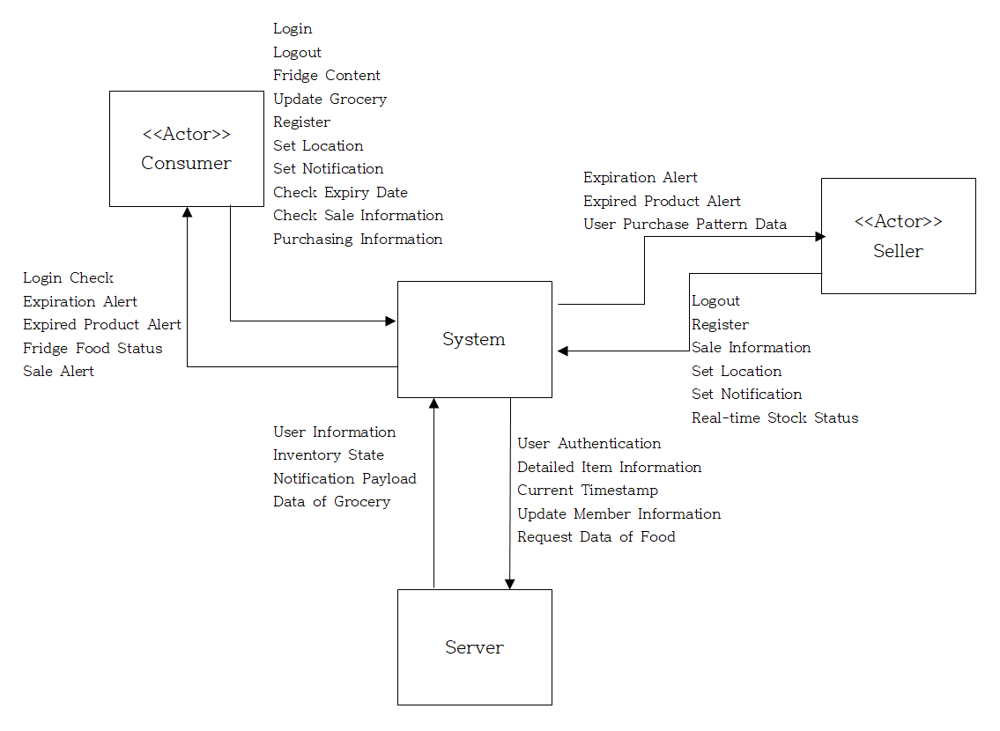

 
<h1> Food Manager</h1>
<h2 style="border-bottom: none;">1. Conceptualization 
 
22211994,남재민,njm739@gmail.com</h2>

 
 
 
 
 
 
<h2 style="border-bottom: none;">
[ Revision history ]

| Revision date | Version # | Description | Author |
| :---: | :---: | :---: | :---: |
| 2026-03-21 | 1.0.0 | Initial Concept |Nam Jae-min |
| 2026-03-27 | 1.0.1 |  Edit project description | Nam Jae-min|
</h2>

      
<h2 style="border-bottom: none;">
= Contents =
<pre>

1. Business purpose ................................................................
 
2. System context diagram ..........................................................
 
3. Use case list ...................................................................
 
4. Concept of operation ............................................................
 
5. Problem statement ...............................................................
 
6. Glossary ........................................................................
 
7. References ......................................................................

</pre>
</h2>

        

<h2>
1. Bussiness purpose
</h2>

<h3 style="border-bottom: none;">
1-1. Project Background
</h3>

  
첫번째로, 일상생활에서 우리는 의식주 중 하나인 식을 해결하기위해, 대형마트나 편의점에서도 식료품을 쉽게 살 수 있고 만들어 먹는다. 하지만 우리 현대인들은 직장생활 또는 학교생활로 인해 매우 바쁜 삶을 살고 있다. 그래서 냉장고에는 "언젠가 먹을 거야" 라는 생각으로 산 음식들이 어느샌가 냉장고 쌓여있다. 이 음식들이 바쁜 생활로 인해 냉장고에 있는 지 몰라서 같은 물품을 또 구매하거나, 소비기한이 언제인지 까먹고 지나서 상하게 된다. 그러다 냉장고에서 쓰레기 냄새가 나게 되고 쓰레기로 인해 다른 음식물까지 부패하는 경우가 있다. 이러한 요인들이 음식물 쓰레기의 주된 원인이 된다. 또한, 너무 바쁜 나머지 소비기한이 지난 줄 모르고 음식을 먹어서 식중독에 걸리는 경우도 있다.  
그래서 이러한 문제를 해결하고자 바쁜 사용자들에게 식료품을 구매한 내용에 대한 소비기한을 입력받아서 각 물품들에 대한 소비기한이 임박할때마다 알림을 보내서 빨리 소비하게 하고, 만약에 소비기한을 지나면 사용자에게 알림을 보내는 서비스를 개발하고자 한다.  
두번째로, 매일 우리는 밥을 먹을때 "어떤 음식을 먹을까"라는 고민이 생겨난다. 새로운 음식을 도전하고자 하지만 레시피를 잘몰라 어려워하는 경우가 많다. 그래서 이러한 사용자들에게 현재 냉장고에 있는 음식들로 어떤 요리를 할 수 있는지 알려주고, 레시피까지 알려주는 서비스를 개발하고자 한다.   
세번째로, 판매자 입장에서 소비기한이 임박한 물품들이 많이 팔리지 않아서 결국 소비기한이 지나서 버리는 경우가 있다. 이것 역시 음식물 쓰레기가 되는 경우가 있다. 이 때, 판매자가 이 재고를 처리하기 위해서 세일을 하기도 하지만 소비자들이 그 시간대에 많이 없으면 결국 판매가 많이 되지않아 이 역시 음식물 쓰레기의 원인 중 하나가 된다.  
그래서 판매자들에게도 재고판매에 도움을 주기위해서 판매자가 세일을 하면, 이 서비스에 가입한 소비자들에게 세일 알람을 보내서 소비를 촉진시키게 하여서, 판매자와 소비자 모두 서로 윈윈이 되도록 하는 서비스를 만들고자 한다.

  
1-2. Motivation

- 식재료 부패와 음식물 쓰레기 발생  
- 현재 냉장고 물품 소비기한 확인 어려움  
- 소비기한 지난 식재료 섭취로 인한 식중독 발생  
- 소비기한이 얼마 남지않은 재고 처리의 어려움  

  
1-3. Goal

- 소비기한이 임박하거나 지난 음식을 사용자에게 알려주는 서비스를 제공하는 어플리케이션 개발  
- 판매자 입장에서도 소비기한이 임박한 물건들을 재고 처리를 도와주는 서비스를 제공함 ( ex:할인을 할때 가입한 사용자들에게 알려주는 서비스)  

  
1.4 Target market

- 일상생활에 바빠서 소비기한을 까먹는 사용자
- 재고 처리에 어려워하는 판매자들

  

        
<h2>
2. System context diagram 
</h2>

 

  

  
- Login 	: 로그인  
- Logout	: 로그아웃  
- Fridge Content: 현재 냉장고 내 정보 
- Update Grocery: 식재료의 정보 
- Register: 회원가입 
- Set Location: 위치 등록 
- Set Notification: 알림설정 
- Check Expiry Date: 소비기한 확인 
- Check Sale Information: 할인 확인 
- Purchasing Information: 구매 내역 
- Login Check: 로그인 정보 확인 
- Expiration Alert: 소비기한 만료 임박 알림 
- Expired Product Alert:　소비기한 만료 알림 
- Fridge Food Status: 식품 정보 
- Sale Alert: 할인 정보 
- User Purchase Pattern Data: 사용자의 구매 정보  
- Sale Information: 할인 정보 등록 및 알림 
- Real-time Stock Status: 실시간 재고 상태 등록 
- User Information: 사용자 정보 
- Inventory State: 재고품 정보 
- Notification Payload: 알림 내용 
- User Authentication: 로그인 정보  
- Data of Grocery: 식료품 정보 
- Detailed Item Information: 물건의 자세한 정보 
- Current TimeStamp: 현재 시간 
- Updatae Member Information: 멤버 정보 업데이트 
- Request Data of Food: 음식의 정보 요청 

   

<h2>3. Use case list</h2>

  
3.1. Login
| Actor | Consumer, Seller |
| :--- | :--- |
| Description  | 소비자와 판매자가 모두 각자의 아이디와 비밀번호로 로그인한다. |
 

3.2. Register
| Actor | Consumer, Seller |
| :--- | :--- |
| Description  | 소비자와 판매자가 자신의 계정을 등록한다. 소비자이면 자신의 이름 전화번호 등을 등록하고, 판매자이면 자신의 업장을 등록한다. |
 

3.3 Set Location
| Actor | Consumer, Seller |
| :--- | :--- |
| Description  | 소비자와 판매자 모두 자신의 위치정보를 등록한다. |
 

3.4. Set Notification
| Actor | Consumer, Seller |
| :--- | :--- |
| Description  | 소비자와 판매자가 모두 알림설정을 등록한다. |
 

3.5 Add Fridge Content
| Actor | Consumer |
| :--- | :--- |
| Description  | 소비자가 현재 자신의 냉장고 내에 어떤 식료품이 있는지 등록하고 정보를 등록한다. |
 

3.6 Update Grocery
| Actor | Consumer |
| :--- | :--- |
| Description  | 소비자가 등록된 자신의 식료품에 대한 정보를 변경한다. |
 

3.7 Check Expiry Date
| Actor | Consumer,Seller |
| :--- | :--- |
| Description  | 소비자와 판매자가 모두 현재 자신이 가지고 있는 음식의 소비기한의 만료일자를 확인한다. |
 

3.8. Check Sales
| Actor | Consumer |
| :--- | :--- |
| Description  | 소비자가 현재 자신의 위치 주변에서 진행중인 할인 내용들을 확인한다. |
 

3.9. Purchasing Information
| Actor | Consumer |
| :--- | :--- |
| Description  | 소비자가 구매한 식료품의 정보를 등록한다.|
 

3.10. Expiration Notification
| Actor | Consumer, Seller |
| :--- | :--- |
| Description  | 시스템이 소비자 또는 판매자가 가지고 있는 식료품의 소비기한의 만료가 얼마 남지 않았을 때 소비자 또는 판매자에게 알림을 보낸다. |
 

3.11. Expired Product Alert
| Actor | Consumer, Seller |
| :--- | :--- |
| Description  | 시스템이 소비자 또는 판매자가 가지고 있는 식료품의 소비기한이 만료되었을 때 소비자 또는 판매자에게 알림을 보낸다. |
 

3.12. Real-time Stock Status
| Actor | Seller |
| :--- | :--- |
|  Description | 판매자가 자기 업장의 재고품의 상태(수량 및 소비기한)를 등록한다. |
 

3.13. Sale Information
| Actor | Seller |
| :--- | :--- |
|  Description | 판매자가 소비기한이 임박한 재고품을 판매하기 위해서 세일정보를 등록한다. 등록된 내용은 소비자에게 알람을 보낸다. |
 

3.14. Purchase Pattern Data
| Actor | Seller |
| :--- | :--- |
|  Description  | 판매자가 소비자가 구매한 구매 내역에 대한 정보를 시스템으로부터 제공받는다. |
 

   
<h2>
4. Use case list
</h2>

1) Login  

| **Purpose** | 앱을 사용하기 위해 등록된 사용자인지 확인 |
| :--- | :--- |
| **Approach** | 사용자가 앱을 실행 후 로그인 시, ID, PW를 입력 후 로그인을 요청하면 서버에서 회원 정보를 조회 후 로그인 성공/실패 여부 확인한다. |
| **Dynamics** | 앱 실행 시 로그인할 경우 |
| **Goals** | 로그인 기능을 구현한다. |
 

2) Register  

| **Purpose** | 앱을 사용하기 위해 사용자 등록 |
| :--- | :--- |
| **Approach** | 사용자가 앱을 최초로 실행해 아이디가 없을 시, 회원가입을 위해서 사용자의 ID, PW, 전화번호를 입력받고 중복된 ID가 없는지 서버 DB에 확인한다. 중복된 ID가 DB에 없으면 PW를 한번 더 입력받고 사용자의 유형이 소비자인지 판매자인지 선택하게 하고, 만약 판매자일 경우 사업장을 등록하게 한다. |
| **Dynamics** | 앱을 최초로 실행해 회원가입을 하는 경우 |
| **Goals** | 회원가입 기능을 구현한다. |
 

3) Set Location  

| **Purpose** | 사용자의 현재 위치를 알기 위해 위치 등록 |
| :--- | :--- |
| **Approach** | 사용자가 앱을 최초로 실행한 경우, 사용자의 위치정보를 알기 위해 위치정보(GPS) 등록 동의를 받고 위치에 대한 위도/경도 정보를 서버 DB에 등록한다. |
| **Dynamics** | 앱을 최초로 실행해 위치정보를 등록하는 경우 |
| **Goals** | 위치정보 동의를 받는 기능을 구현하고 DB에 사용자 위치를 등록한다. |
 

4) Set Notification  

| **Purpose** | 사용자의 푸시 알림 수시 여부 및 알림 정보 등록 |
| :--- | :--- |
| **Approach** | 사용자가 앱을 최초로 실행한 경우, 사용자에게 앱 알림 설정의 동의를 구한다. 사용자의 식료품 소비기한의 만료 임박하기 전 3일 이내 7일 이내, 10일 이내, 또는 사용자 정의시간 등 언제 알림을 보낼지 설정할 수 있게 선택한다. |
| **Dynamics** | 앱을 최초로 실행해 앱 알림 설정을 등록하는 경우 |
| **Goals** | 사용자들에게 알림을 보내서 직접 소비기한을 확인하지 않아도 되는 편리함을 제공한다. |
 

5) Add Fridge Content  

| **Purpose** | 소비자 냉장고의 정보 등록 |
| :--- | :--- |
| **Approach** | 소비자가 앱을 실행해, 자신의 냉장고에 있는 식료품의 정보를 입력한다. 이 입력된 내용에는 제품의 수량, 제품의 소비기한등이 담겨져있게 되며 각 정보들은 서버의 DB에 저장된다. |
| **Dynamics** | 소비자가 자신의 냉장고의 정보를 등록하는 경우 |
| **Goals** | 식료품을 한 번 저장하면 편리하게 관리할 수 있게하는 기능을 제공한다. |
 

6) Update Grocery  

| **Purpose** | 사용자의 식료품에 대한 정보 변경 |
| :--- | :--- |
| **Approach** | 사용자가 등록한 식료품이 판매되거나 사용되는 것과 같이 식료품의 정보를 변경해야 하는 경우, 등록된 식료품의 정보를 보여주고 각 정보를 변경할 수 있게하는 기능을 제공한다. 그리고 변경된 내용은 서버의 DB에 반영된다. |
| **Dynamics** | 사용자가 등록된 식료품의 정보를 변경하고자 하는 경우 |
| **Goals** | 등록된 식료품의 정보를 편리하게 변경하는 기능을 제공한다. |
 

7) Check Expiry Date  

| **Purpose** | 식료품의 소비기한 확인 |
| :--- | :--- |
| **Approach** | 사용자가 앱에서 현재 등록된 식료품의 소비기한을 확인하고자 하는 경우, 앱에서 만료 임박 순이나 등록된 순으로 선택하게 하여서 등록된 식료품을 한눈에 볼 수 있게 해준다. |
| **Dynamics** | 사용자가 등록된 식료품의 소비기한을 확인 하고자 하는 경우 |
| **Goals** | 등록된 식료품의 소비기한을 한눈에 보여주는 기능을 제공한다. |
 

8) Check Sales  

| **Purpose** | 현재 소비자 주변에서 진행 중인 할인 확인  |
| :--- | :--- |
| **Approach** | 소비자가 음식을 구매하기 전 앱을 실행해 자신의 주변에서 현재 할인 중인 가게를 확인하고자 하는 경우, 현재 소비자 동의한 위치정보(GPS)를 기준으로 할인이 진행 중인 가게를 보여준다. 이때 판매자가 등록한 할인이 소비자의 앱에서 나오게 된다. |
| **Dynamics** | 소비자가 할인 중인 내용을 보고 싶은 경우 |
| **Goals** | 생산자가 등록한 할인의 내용을 소비자의 위치정보를 기준으로 보여주는 기능을 제공한다. |
 

9) Purchasing Information  

| **Purpose** | 소비자가 방금 구매한 식료품 내역을 등록  |
| :--- | :--- |
| **Approach** | 소비자가 가게에서 식료품을 구매하는 경우, 소비자가 구매한 내역을 앱에서 어디서 구매하였고, 어떤 물품을 구매하였는지, 그리고 그 식료품의 소비기한은 언제인지 정보를 등록한다 |
| **Dynamics** | 소비자가 구매한 식료품을 한번에 등록하고자 하는 경우 |
| **Goals** | 구매한 식료품의 정보를 앱에 등록함으로써, 앱에서 식료품의 소비기한과 현재 날짜의 차이를 분석할 수 있게 된다.|
 

10) Expiration Notification  

| **Purpose** | 소비기한의 만료가 임박함을 알림 |
| :--- | :--- |
| **Approach** | 사용자가 서버 DB에 등록한 식료품의 소비기한의 만료일이 점점 다가오는 경우 앱 알림으로 사용자가 선택한 날짜부터 하루 간격으로 계속해서 몇일 남았는지 알려줌. |
| **Dynamics** | 설정한 소비기한의 만료가 임박할 경우 |
| **Goals** | 사용자가 소비기한을 계속해서 신경 쓰지 않아도 저절로 알림이 오는 기능을 제공 |
 

11) Expired Product Alert  

| **Purpose** | 소비기한이 만료되었음을 알림 |
| :--- | :--- |
| **Approach** | 사용자가 등록한 식료품의 소비기한이 만료되었을 경우, 앱 알림으로 식료품의 소비기한이 지났음을 알려줌. |
| **Dynamics** | 소비기한이 만료되었을 경우 |
| **Goals** | 사용자가 소비기한이 지난 것들을 알려줘서 그에 따른 조치를 바로 취할 수 있게 함. |
 

12) Real-time Stock Status  

| **Purpose** | 매장 내 재고품의 상태를 등록  |
| :--- | :--- |
| **Approach** | 판매자가 앱을 실행해, 현재 자신의 매장에 있는 식료품의 정보를 등록하는 경우, 서버에 DB에 입력한 내용이 등록됨. |
| **Dynamics** | 판매자가 자신의 매장 내 식료품의 정보를 저장하는 경우 |
| **Goals** | 현재 매장의 재고 상태를 한눈에 점거할 수 있는 기능을 제공 |
 

13) Sale Information 

| **Purpose** | 업장의 세일 정보를 등록  |
| :--- | :--- |
| **Approach** | 판매자가 판매자의 업장에 있는 식료품을 할인하려고 하는 경우, 앱에 등록함. 언제부터 언제까지 하며 어떤 물품을 할인하는지 관해 입력함. 앱은 이 내용을 판매자의 업장 위치 서비스(GPS)를 이용해 주변에 있는 소비자에게 앱 알림을 보냄. |
| **Dynamics** | 판매자가 세일 정보를 등록하려고 하는 경우 |
| **Goals** | 판매자가 등록된 세일 정보로 소비자들이 구매를 촉진되어 판매자의 이익 증가 및 건전한 소비 환경 제공 |
 

14) Purchase Pattern Data  

| **Purpose** | 소비자가 구매한 이력을 판매자에게 전송 |
| :--- | :--- |
| **Approach** | 소비자가 앱에 등록된 판매자의 업장에서 물건을 구매하고, 구매 정보를 등록 (Purchase Information)을 한 경우, 판매자의 업장에 있는 식료품의 정보에 자동으로 반영됨. |
| **Dynamics** | 소비자가 앱에 등록된 판매자의 업장에서 물건을 구매하고 구매정보를 등록한 경우 |
| **Goals** | 판매자의 재고품 관리가 용이하고 편리해지는 효과 제공 |
 

   

<h2>
5. Problem statement
</h2>

Problem #1 : 사진정보 파악 
영수증을 사진으로 찍어서 인식하는 것을 배운적이 없다. OCR로 텍스트를 추출하는 기술을 사용해본적이 없다.
따라서 이와 관련된 내용을 공부할것이다. 또 그림자, 구김, 비표준 약어로 인해 영수증에 있는 물품이 똑바로 인식되지 않는 경우가 발생할 수 있다.
  
Problem #2 : 수동입력의 번거로움 
사람들이 바쁜 생활에 살고있기 때문에 앱에서 냉장고에서 어떤것을 먹었다 라는 것을 체크하는 과정이 귀찮아서 스킵하는 경우가 발생할 수 있다. 그렇게 되면 실제로는 음식이 존재하지않지만 앱에서는 존재하게 되어서 없는 존재로 인한 알림이 오는 상황이 발생할 수 있다. 
  
Problem #3 : DB 문제 
DB에 대한 공부를 해본적이 없다. 따라서 DB에 대한 공부를 해서 앱에서 잘 활용을 할 수 있도록 해야한다.
  
Problem #4 : 안드로이드 OS 앱 개발 
안드로이드 앱을 개발을 해본적이 없다. 코틀린과 관련된 언어를 배우고 활용을 잘 할 수 있도록 공부해야한다.
    
NFRS 
1. 언어는 자바와 Kotlin을 사용한다. 
2. 검색성능은 3초정도로 해야한다. 
3. 데이터베이스는 MySQL을 사용한다. 
  

<h2>
6. Glossary 
</h2>

| 용어 | 설명 |
| :--- | :--- |
| Food Manager | 이 프로그램의 이름 |
| 소비자 | 식료품을 구매하는 사람 |
| 판매자 | 사업장을 가지고 식료품을 판매하는 사람 |
| 레시피 | 식료품등을 이용해 만들 수 있는 조리법 |
 

<h2>
7. References
</h2>

Kotlin: <a>https://kotlinlang.org/</a>  
음식물 쓰레기 문제: <a>https://www.dokdok.co/brief/food-waste</a>  
