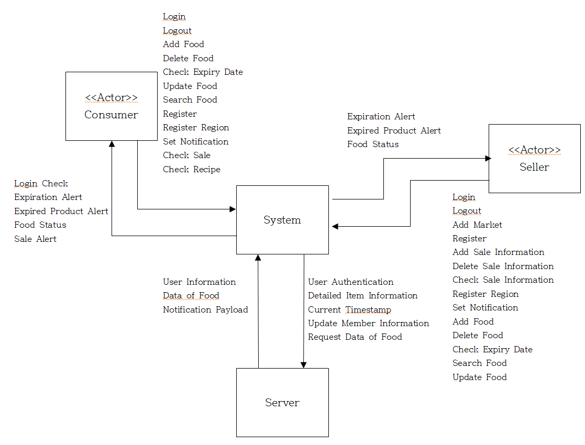

 
<h1> Food Manager</h1>
<h2 style="border-bottom: none;">1. Conceptualization 
 
22211994,남재민,njm739@gmail.com</h2>

 
 
 
 
 
 
<h2 style="border-bottom: none;">
[ Revision history ]

| Revision date | Version # | Description | Author |
| :---: | :---: | :---: | :---: |
| 2026-03-21 | 1.0.0 | Initial Concept |Nam Jae-min |
| 2026-03-27 | 1.0.1 | Edit project description | Nam Jae-min|
| 2026-05-08 | 1.0.2 | Edit Content | Nam Jae-min|
| 2026-06-01 | 1.0.3 | Insert Content | Nam Jae-min |
</h2>

      
<h2 style="border-bottom: none;">
= Contents =
<pre>

1. Business purpose ................................................................
 
2. System context diagram ..........................................................
 
3. Use case list ...................................................................
 
4. Concept of operation ............................................................
 
5. Problem statement ...............................................................
 
6. Glossary ........................................................................
 
7. References ......................................................................

</pre>
</h2>

        

<h2>
1. Bussiness purpose
</h2>

<h3 style="border-bottom: none;">
1-1. Project Background
</h3>

  
첫번째로, 일상생활에서 우리는 의식주 중 하나인 식을 해결하기위해, 대형마트나 편의점에서도 식료품을 쉽게 살 수 있고 만들어 먹는다. 하지만 우리 현대인들은 직장생활 또는 학교생활로 인해 매우 바쁜 삶을 살고 있다. 그래서 냉장고에는 "언젠가 먹을 거야" 라는 생각으로 산 음식들이 어느샌가 냉장고 쌓여있다. 이 음식들이 바쁜 생활로 인해 냉장고에 있는 지 몰라서 같은 물품을 또 구매하거나, 소비기한이 언제인지 까먹고 지나서 상하게 된다. 그러다 냉장고에서 쓰레기 냄새가 나게 되고 쓰레기로 인해 다른 음식물까지 부패하는 경우가 있다. 이러한 요인들이 음식물 쓰레기의 주된 원인이 된다. 또한, 너무 바쁜 나머지 소비기한이 지난 줄 모르고 음식을 먹어서 식중독에 걸리는 경우도 있다.  
그래서 이러한 문제를 해결하고자 바쁜 사용자들에게 식료품을 구매한 내용에 대한 소비기한을 입력받아서 각 물품들에 대한 소비기한이 임박할때마다 알림을 보내서 빨리 소비하게 하고, 만약에 소비기한을 지나면 사용자에게 알림을 보내는 서비스를 개발하고자 한다.  
두번째로, 매일 우리는 밥을 먹을때 "어떤 음식을 먹을까"라는 고민이 생겨난다. 새로운 음식을 도전하고자 하지만 레시피를 잘몰라 어려워하는 경우가 많다. 그래서 이러한 사용자들에게 현재 냉장고에 있는 음식들로 어떤 요리를 할 수 있는지 알려주고, 레시피까지 알려주는 서비스를 개발하고자 한다.   
세번째로, 판매자 입장에서 소비기한이 임박한 물품들이 많이 팔리지 않아서 결국 소비기한이 지나서 버리는 경우가 있다. 이것 역시 음식물 쓰레기가 되는 경우가 있다. 이 때, 판매자가 이 재고를 처리하기 위해서 할인을 하기도 하지만 소비자들이 그 시간대에 많이 없으면 결국 판매가 많이 되지않아 이 역시 음식물 쓰레기의 원인 중 하나가 된다.  
그래서 판매자들에게도 재고판매에 도움을 주기위해서 판매자가 할인을 하면, 이 서비스에 가입한 소비자들에게 할인 알람을 보내서 소비를 촉진시키게 하여서, 판매자와 소비자 모두 서로 윈윈이 되도록 하는 서비스를 만들고자 한다.

  
1-2. Motivation

- 식재료 부패와 음식물 쓰레기 발생  
- 현재 냉장고 물품 소비기한 확인 어려움  
- 소비기한 지난 식재료 섭취로 인한 식중독 발생  
- 소비기한이 얼마 남지않은 재고 처리의 어려움  

  
1-3. Goal

- 소비기한이 임박하거나 지난 음식을 사용자에게 알려주는 서비스를 제공하는 어플리케이션 개발  
- 판매자 입장에서도 소비기한이 임박한 물건들을 재고 처리를 도와주는 서비스를 제공함 ( ex:할인을 할때 가입한 사용자들에게 알려주는 서비스)  

  
1.4 Target market

- 일상생활에 바빠서 소비기한을 까먹는 사용자
- 재고 처리에 어려워하는 판매자들

  

        
<h2>
2. System context diagram 
</h2>

 

  

  
- Login 	: 로그인  
- Logout	: 로그아웃  
- Update Food: 식료품의 정보 변경 
- Register: 회원가입 
- Register Region: 위치 등록 
- Set Notification: 알림설정 
- Check Expiry Date: 소비기한 확인 
- Check Sale Information: 할인 확인 
- Check Recipe: 레시피 확인 
- Login Check: 로그인 정보 확인 
- Expiration Alert: 소비기한 만료 임박 알림 
- Expired Product Alert:　소비기한 만료 알림 
- Add Food: 식료품 정보 등록 
- Sale Alert: 할인 알림 
- Delete Food: 식료품 정보 삭제  
- Search Food: 식료품 찾기 
- Add Market : 사업장 등록 
- Add Sale Information: 할인 정보 등록 
- Delete Sale Information: 할인 정보 삭제 
- Check Sale Information: 할인 정보 관리 
- User Information: 사용자 정보 
- Data of Food: 식료품 정보 
- Notification Payload: 알림 내용 
- User Authentication: 로그인 정보  
- Detailed Item Information: 물건의 자세한 정보 
- Current TimeStamp: 현재 시간 
- Updatae Member Information: 멤버 정보 업데이트 
- Request Data of Food: 음식의 정보 요청 

   

<h2>3. Use case list</h2>

  
3.1. Login
| Actor | Consumer, Seller |
| :--- | :--- |
| Description  | 사용자가 각자의 아이디와 비밀번호로 로그인한다. |
 

3.2. Register
| Actor | Consumer, Seller |
| :--- | :--- |
| Description  | 소비자와 판매자가 자신의 계정을 등록한다. 소비자이면 자신의 이름 전화번호 등을 등록하고, 판매자이면 자신의 업장을 등록한다. |
 

3.3 Register Region
| Actor | Consumer, Seller |
| :--- | :--- |
| Description  | 소비자와 판매자 모두 자신의 위치정보를 등록한다. |
 

3.4. Set Notification
| Actor | Consumer, Seller |
| :--- | :--- |
| Description  | 사용자가 알림설정을 등록한다. |
 

3.5 Logout
| Actor | Consumer,Seller |
| :--- | :--- |
| Description  | 사용자가 앱 사용을 종료하기 위해 현재 계정의 인증 세션을 해제하고 접속 상태를 종료한다. |

3.6 Add Food
| Actor | Consumer,Seller |
| :--- | :--- |
| Description  | 사용자가 현재 자신의 냉장고 내에 어떤 식료품이 있는지 등록하고 정보를 등록한다. |
 

3.7 Update Food
| Actor | Consumer,Seller |
| :--- | :--- |
| Description  | 사용자가 등록된 자신의 식료품에 대한 정보를 변경한다. |
 

3.8 Delete Food
| Actor | Consumer,Seller |
| :--- | :--- |
|  Description | 사용자가 등록된 자신의 식료품에 대한 정보를 삭제한다. |
 

3.9 Search Food
| Actor | Consumer,Seller |
| :--- | :--- |
|  Description | 사용자가 등록된 식료품들중 특정 검색 조건에 해당하는 식료품을 검색한다.|
 

3.10 Check Expiry Date
| Actor | Consumer,Seller |
| :--- | :--- |
| Description  | 사용자가 현재 자신이 가지고 있는 음식의 소비기한의 만료일자를 확인한다. |
 

3.11. Check Sale
| Actor | Consumer |
| :--- | :--- |
| Description  | 소비자가 현재 자신의 위치 주변에서 진행중인 할인 내용들을 확인한다. |
 

3.12. Check recipe
| Actor | Consumer |
| :--- | :--- |
| Description  | 소비자가 현재 등록한 식료품으로 만들 수 있는 레시피를 확인한다.|
 

3.13. Expiration Notification
| Actor | Consumer, Seller |
| :--- | :--- |
| Description  | 시스템이 소비자 또는 판매자가 가지고 있는 식료품의 소비기한의 만료가 얼마 남지 않았을 때 소비자 또는 판매자에게 알림을 보낸다. |
 

3.14. Expired Product Alert
| Actor | Consumer, Seller |
| :--- | :--- |
| Description  | 시스템이 소비자 또는 판매자가 가지고 있는 식료품의 소비기한이 만료되었을 때 소비자 또는 판매자에게 알림을 보낸다. |
 

3.15. Add Market
| Actor | Seller |
| :--- | :--- |
|  Description | 판매자가 자기 업장에 대한 정보(위치, 사업자 번호, 카테고리)를 시스템에 입력한다. |
 

3.16. Add Sale Information
| Actor | Seller |
| :--- | :--- |
|  Description | 판매자가 소비기한이 임박한 재고품을 판매하기 위해서 할인정보를 등록한다. 등록된 내용은 소비자에게 알람을 보낸다. |
 

17) Delete Sale Information

| Actor | Seller |
| :--- | :--- |
|  Description | 판매자가 잘못된 정보(잘못된 수량 또는 오타) 이나 할인기간의 지남으로 인해 등록된 할인정보를 삭제한다.|
 

18) Check Sale Information

| Actor | Seller |
| :--- | :--- |
|  Description | 판매자가 현재 시스템에 등록된 할인정보를 한눈에 확인이 가능하다.|

 

   
<h2>
4. Use case list
</h2>

1) Login  

| **Purpose** | 앱을 사용하기 위해 등록된 사용자인지 확인 |
| :--- | :--- |
| **Approach** | 사용자가 앱을 실행 후 로그인 시, ID, PW를 입력 후 로그인을 요청하면 서버에서 회원 정보를 조회 후 로그인 성공/실패 여부 확인한다. |
| **Dynamics** | 앱 실행 시 로그인할 경우 |
| **Goals** | 로그인 기능을 구현한다. |
 

2) Register  

| **Purpose** | 앱을 사용하기 위해 사용자 등록 |
| :--- | :--- |
| **Approach** | 사용자가 앱을 최초로 실행해 아이디가 없을 시, 회원가입을 위해서 사용자의 ID, PW를 입력받고 중복된 ID가 없는지 서버 DB에 확인한다. 중복된 ID가 DB에 없으면 로그인에 성공하고, 사용자의 유형이 소비자인지 판매자인지 선택하게 하고, 만약 판매자일 경우 즉시 사업장을 등록하게 한다. |
| **Dynamics** | 앱을 최초로 실행해 회원가입을 하는 경우 |
| **Goals** | 회원가입 기능을 구현한다. |
 

3) Register Region  

| **Purpose** | 사용자의 현재 위치를 알기 위해 위치 등록 |
| :--- | :--- |
| **Approach** | 사용자가 앱을 실행해 위치등록을 누른 경우, 사용자의 위치정보를 알기 위해 위치정보입력을 받고 그 내용을 서버 DB에 등록한다. |
| **Dynamics** | 앱을 최초로 실행해 위치정보를 등록하는 경우 |
| **Goals** | 위치정보 입력 받아서 DB에 사용자 위치를 등록한다. |
 

4) Set Notification  

| **Purpose** | 사용자의 푸시 알림 수시 여부 및 알림 정보 등록 |
| :--- | :--- |
| **Approach** | 사용자가 앱을 최초로 실행한 경우, 사용자에게 앱 알림 설정의 동의를 구한다. 사용자의 식료품 소비기한의 만료 임박하기 전 3일 이내 7일 이내, 10일 이내, 또는 사용자 정의시간 등 언제 알림을 보낼지 설정할 수 있게 선택한다. |
| **Dynamics** | 앱을 최초로 실행해 앱 알림 설정을 등록하는 경우 |
| **Goals** | 사용자들에게 알림을 보내서 직접 소비기한을 확인하지 않아도 되는 편리함을 제공한다. |
 

5) Logout  

| **Purpose** | 사용자의 인증 세션을 종료하고 시스템 접속 권한을 해제함 |
| :--- | :--- |
| **Approach** | 사용자가 설정 화면에서 로그아웃을 선택하면, 시스템은 사용자의 로그아웃 의사를 재확인하는 팝업을 출력함. 확인 시 데이터베이스 내 로그인 상태를 변경하고 클라이언트의 인증 정보를 삭제함. |
| **Dynamics** | 사용자가 시스템 이용을 마치고 계정 접속을 종료하고자 할 때 |
| **Goals** | 사용자 세션을 안전하게 파기하여 개인정보를 보호하고, 앱의 초기 홈 화면으로 무결하게 이동함. |

6) Add Food  

| **Purpose** | 식료품의 정보 등록 |
| :--- | :--- |
| **Approach** | 사용자가 앱을 실행해, 자신의 식료품 저장고에 있는 식료품의 정보를 입력한다. 이 입력된 내용에는 제품의 품목명,제품의 수량, 제품의 소비기한등이 담겨져있게 되며 각 정보들은 서버의 DB에 저장된다. |
| **Dynamics** | 사용자가 식료품의 정보를 등록하는 경우 |
| **Goals** | 식료품을 한 번 저장하면 편리하게 관리할 수 있게하는 기능을 제공한다. |
 

7) Update Food  

| **Purpose** | 사용자의 식료품에 대한 정보 변경 |
| :--- | :--- |
| **Approach** | 사용자가 등록한 식료품이 판매되거나 사용되는 것과 같이 식료품의 정보를 변경해야 하는 경우, 등록된 식료품의 정보를 보여주고 각 정보를 변경할 수 있게하는 기능을 제공한다. 그리고 변경된 내용은 서버의 DB에 반영된다. |
| **Dynamics** | 사용자가 등록된 식료품의 정보를 변경하고자 하는 경우 |
| **Goals** | 등록된 식료품의 정보를 편리하게 변경하는 기능을 제공한다. |
 

8) Delete Food  

| **Purpose** | 식료품 보관소 내 불필요하거나 소비된 품목 데이터를 제거함 |
| :--- | :--- |
| **Approach** | 사용자가 삭제할 품목을 선택하고 삭제(휴지통) 버튼을 누르면, 시스템은 실수 방지를 위해 재확인 팝업을 띄운 후 데이터베이스에서 해당 정보를 영구 삭제함 |
| **Dynamics** | 등록된 음식을 모두 먹었거나, 상해서 버리는 등 보관 중인 리스트에서 제외해야 할 때 |
| **Goals** | 실제 보관 상태와 앱 내 데이터를 일치시켜 정확한 재고 현황을 유지함 |
 

9) Search Food 

| **Purpose** | 보관 중인 많은 식료품 중 특정 조건에 맞는 품목을 빠르게 찾아냄 |
| :--- | :--- |
| **Approach** | 사용자가 검색 창에 이름, 카테고리, 혹은 소비기한 등의 조건을 입력하면, 시스템은 데이터베이스 내에서 필터링을 거쳐 검색어와 일치하는 결과 리스트만 화면에 출력함 |
| **Dynamics** | 보관된 품목이 많아 스크롤만으로 찾기 힘들거나, 특정 카테고리(예: 유제품)의 소비기한을 모아보고 싶을 때 |
| **Goals** | 사용자가 원하는 정보에 접근하는 시간을 단축하여 시스템 사용의 편의성을 높임 |
 

10) Check Expiry Date  

| **Purpose** | 식료품의 소비기한 확인 |
| :--- | :--- |
| **Approach** | 사용자가 앱에서 현재 등록된 식료품의 소비기한을 확인하고자 하는 경우, 앱에서 만료 임박 순이나 등록된 순으로 선택하게 하여서 등록된 식료품을 한눈에 볼 수 있게 해준다. |
| **Dynamics** | 사용자가 등록된 식료품의 소비기한을 확인 하고자 하는 경우 |
| **Goals** | 등록된 식료품의 소비기한을 한눈에 보여주는 기능을 제공한다. |
 

11) Check Sale  

| **Purpose** | 현재 소비자 주변에서 진행 중인 할인 확인  |
| :--- | :--- |
| **Approach** | 소비자가 음식을 구매하기 전 앱을 실행해 자신의 주변에서 현재 할인 중인 가게를 확인하고자 하는 경우, 현재 소비자 위치를 기준으로 할인이 진행 중인 가게를 보여준다. 이때 판매자가 등록한 할인이 소비자의 앱에서 나오게 된다. |
| **Dynamics** | 소비자가 할인 중인 내용을 보고 싶은 경우 |
| **Goals** | 판매자가 등록한 할인의 내용을 소비자의 위치를 기준으로 보여주는 기능을 제공한다. |
 

12) Check recipe
 

| **Purpose** | 소비자가 보유한 식료품을 주재료로 활용할 수 있는 다양한 레시피 정보를 조회함  |
| :--- | :--- |
| **Approach** | 소비자가 특정 식료품을 선택하거나 레시피 메뉴에 접속하면, 시스템은 해당 식료품을 포함하는 요리법 리스트를 외부 API 또는 데이터베이스에서 불러와 제공함. 사용자는 난이도, 소요 시간 등의 정보를 함께 확인할 수 있다. |
| **Dynamics** | 유통기한이 임박한 식료품을 빨리 소비해야 하거나, 냉장고에 남은 재료로 어떤 요리를 할지 고민하는 경우. |
| **Goals** | 식료품의 효율적인 소비를 도와 음식물 쓰레기를 줄이고, 소비자에게 식단 구성의 편의성을 제공한다. |
 

13) Expiration Notification  

| **Purpose** | 소비기한의 만료가 임박함을 알림 |
| :--- | :--- |
| **Approach** | 사용자가 서버 DB에 등록한 식료품의 소비기한의 만료일이 점점 다가오는 경우 앱 알림으로 사용자가 선택한 날짜부터 몇일 남았는지 알려줌. |
| **Dynamics** | 설정한 소비기한의 만료가 임박할 경우 |
| **Goals** | 사용자가 소비기한을 계속해서 신경 쓰지 않아도 저절로 알림이 오는 기능을 제공 |
 

14) Expired Product Alert  

| **Purpose** | 소비기한이 만료되었음을 알림 |
| :--- | :--- |
| **Approach** | 사용자가 등록한 식료품의 소비기한이 만료되었을 경우, 앱 알림으로 식료품의 소비기한이 지났음을 알려줌. |
| **Dynamics** | 소비기한이 만료되었을 경우 |
| **Goals** | 사용자가 소비기한이 지난 것들을 알려줘서 그에 따른 조치를 바로 취할 수 있게 함. |
 

15) Add Market 

| **Purpose** | 판매자가 할인 정보를 게시하고 지역 기반 알림을 보낼 수 있도록 자신의 사업장 정보를 시스템에 등록함 |
| :--- | :--- |
| **Approach** | 판매자 가입 직후 리다이렉트된 화면에서 사업장 이름, 위치(주소), 업종 등을 입력함. 시스템은 입력된 주소를 좌표 정보로 변환하여 저장하며, 등록 완료 후 판매자 메인 화면으로 이동함. |
| **Dynamics** | 판매자 계정으로 신규 가입한 직후 또는 기존 판매자가 사업장 정보를 변경/추가해야 할 때 |
| **Goals** | 시스템 내에 유효한 사업장 데이터를 생성하여, 주변 소비자들에게 정확한 할인 정보와 알림을 제공할 수 있는 기반을 마련함. |
 

16) Add Sale Information  

| **Purpose** | 업장의 할인 정보를 등록  |
| :--- | :--- |
| **Approach** | 판매자가 판매자의 업장에 있는 식료품을 할인하려고 하는 경우, 앱에 등록함. 언제부터 언제까지 하며 어떤 물품을 할인하는지 관해 입력함. 앱은 이 내용을 판매자의 위치정보를 이용해 주변에 있는 소비자에게 앱 알림을 보냄. |
| **Dynamics** | 판매자가 할인 정보를 등록하려고 하는 경우 |
| **Goals** | 판매자가 등록된 할인 정보로 소비자들이 구매를 촉진되어 판매자의 이익 증가 및 건전한 소비 환경 제공 |
 

17) Delete Sale Information  

| **Purpose** | 업장의 할인 정보를 삭제  |
| :--- | :--- |
| **Approach** | 판매자가 등록한 할인정보를 삭제하려고 하는 경우, 앱에서 삭제함. 이때 할인정보는 잘못된 정보이거나 할인기간이 지난경우 지움. |
| **Dynamics** | 판매자가 자신의 매장에서 진행중인 할인 정보를 지우려는 경우 |
| **Goals** | 판매자가 잘못된 정보로 등록된 할인정보를 지움. 편리하게 할인정보를 관리가능. |
 

18) Check Sale Information 

| **Purpose** | 판매자가 자신이 등록한 할인 정보 리스트를 확인함  |
| :--- | :--- |
| **Approach** | 판매자가 '내 사업장 관리' 또는 '할인 내역' 메뉴에 접속하면, 시스템은 해당 판매자의 ID와 연결된 사업장에서 등록한 진행 중인 할인 정보를 리스트 형태로 출력함 |
| **Dynamics** | 판매자가  등록된 할인 정보를 확인함 |
| **Goals** | 판매자가 업장에 등록된 할인 정보가 제대로 등록이 되어있는지 한눈에 확인이 가능해져서 관리가 편리해짐.  |
 

   

<h2>
5. Problem statement
</h2>

Problem #1 : 프론트엔드 개발 
앱을 개발하거나 할때는 분명히 프론트엔드가 필요하다 따라서, 프론트엔드를 배운적이 없기 때문에 공부하여야한다.
  
Problem #2 : DB 문제 
DB에 대한 공부를 해본적이 없다. 따라서 DB에 대한 공부를 해서 앱에서 잘 활용을 할 수 있도록 해야한다.
  
Problem #3 : 앱 개발 
안드로이드 앱을 개발을 해본적이 없다.따라서 자바로 앱을 개발할 것이다. 자바로 앱을 개발하는 방법을 공부 할 것이다.
    
NFRS 
1. 백엔드 언어는 자바를 사용한다. 
2. 검색성능은 3초정도로 해야한다. 
3. 데이터베이스는 PostgreSQL을 사용한다. 
  

<h2>
6. Glossary 
</h2>

| 용어 | 설명 |
| :--- | :--- |
| Food Manager | 이 프로그램의 이름 |
| 소비자 | 식료품을 구매하는 사람 |
| 판매자 | 사업장을 가지고 식료품을 판매하는 사람 |
| 레시피 | 식료품등을 이용해 만들 수 있는 조리법 |
 

<h2>
7. References
</h2>

Kotlin: <a>https://kotlinlang.org/</a>  
음식물 쓰레기 문제: <a>https://www.dokdok.co/brief/food-waste</a>  
